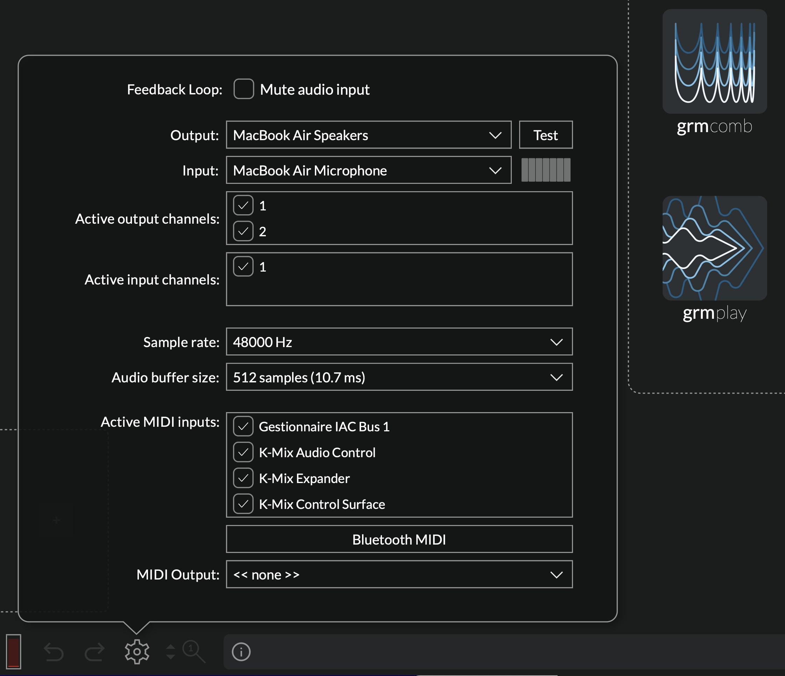
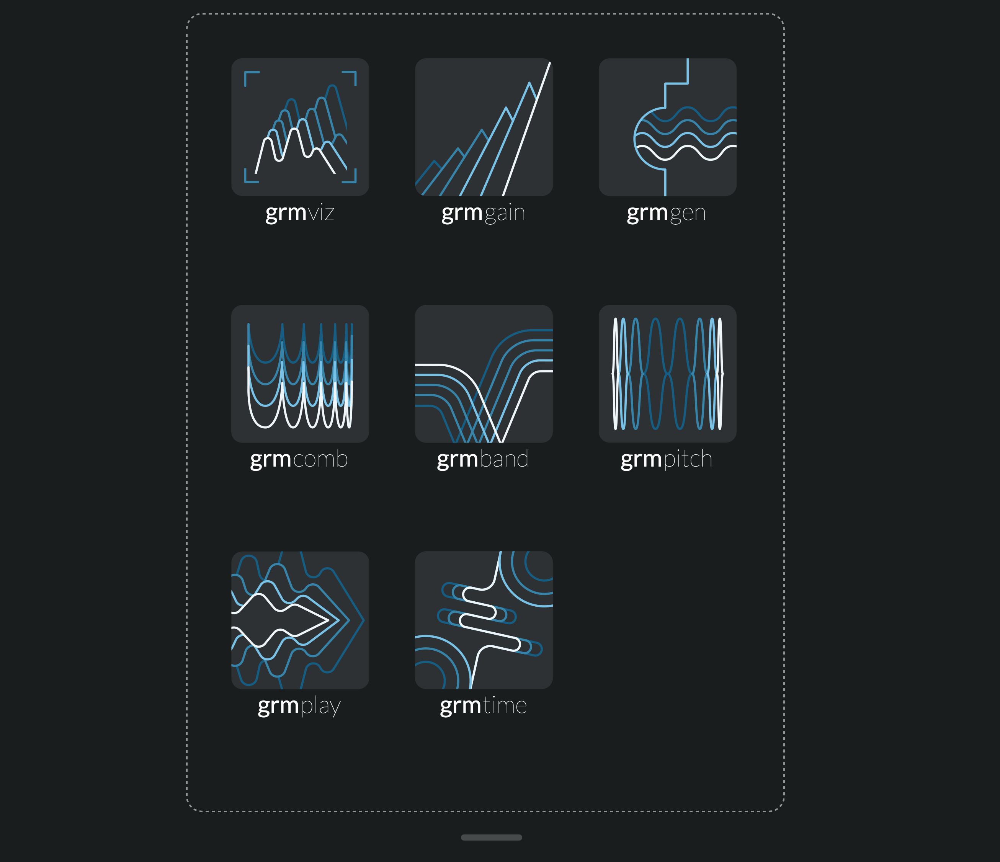
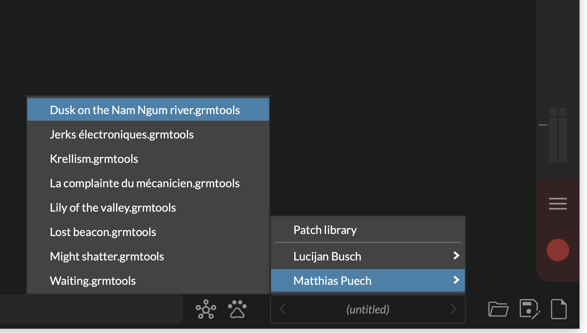
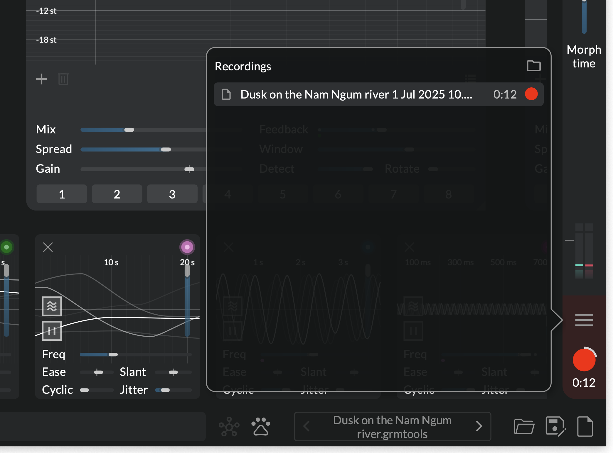

# Getting Started

Thanks for your interest in _GRM Tools Atelier_! Here are a few steps to help you get started making
sound with _Atelier_.

## Installation

Running the installer will install on your system:

* The standalone application in `/Applications`;
* The _GRM Tools Atelier_ plugin, in all the supported plugin formats:
    - AAX for use with _Avid Pro Tools_, in `/Library/Application Support/Avid/Audio/Plug-ins`;
    - AU for use with _Apple Logic_ and compatible hosts, in `/Library/Audio/Plugins/Components`;
    - VST3 for use in most other hosts, in `/Library/Audio/Plugins/VST3`;
* Example patches to get you started.

## Authorization

<!-- TODO: to modify once we have the definitive protection -->

On the first start (app or standalone), you will be invited to authorize your beta copy. Follow the
indicated steps, and paste the code that was sent back to you. Once the authorization popup
disappears, you are ready to go.

## Application audio & MIDI setup

Then, set up your audio interface. In the status bar, click the gear icon to reveal the settings:

* select an output device, and enable all channels connected to your speakers
* optionally select an input device and enable the corresponding channels
* optionally set up any MIDI controller below
* watch out for feedback if you have a microphone near your loudspeakers, then untick "Mute audio
  input"

The number of output channels set up determines how many channels the processors will work with.

## Use as a plugin

_Atelier_ can be used as a plugin in a VST3/AU/AAX host. The plugin and the standalone app offer the
exact same functionality; patches created on one can be used with the other.

## And now?

When first started, Atelier greets you with an empty patch, showing the list of available
processors. Sound is passed through, unaffected.

!!! note

    Subsequently when the application is started, it opens the last opened patch.

Insert a processor from the splash screen and start playing around. Click the "+" buttons to add
other modules, either processors or modulators. Processors process sound in series, from left to
right; drag a module from its title bar to move it. Drag a wire from the colored round handle of a
modulator and start modulating a parameter.

In the status bar next to the file icons is the patch browser. Click it to bring up the
factory-supplied library of patches, draw some inspiration and explore the capabilities of _GRM
Tools Atelier_.

In the sidebar are two meters and their associated gain sliders: input and output.

Once satisfied with the result, either save the patch (_File > Save_) or record an audio file in
real time by clicking the "Record" button in the bottom right corner. The recording has as many
channels as the number of outputs configured and is 32 bits floating point, so you don't have to
worry about clipping.

The resulting file will be saved on the desktop by default, or in the current patch's directory.
Click the "Burger" button to view all recordings and modify the destination directory.

!!! note

    In the recorded file list popup, files can be dragged e.g. to your DAW's window, or
    directly in the _Atelier_ window (processor row), which makes a new instance of _Play_. Perfect
    for on-the-fly resampling!

Happy patching!
