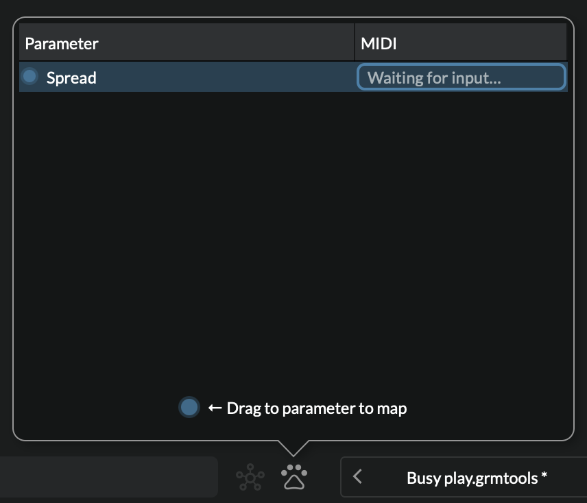
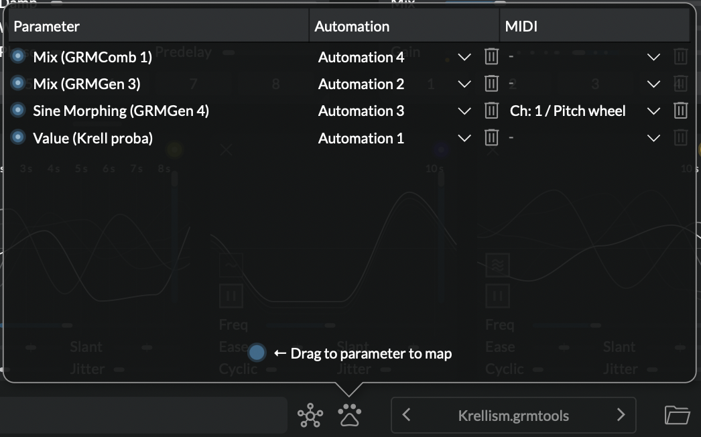

# MIDI and automations

_Atelier_ provides a simple way to map any parameter to your hardware MIDI controllers or keyboards. Similarly, any parameter can be automated from your DAW when used as a [plug-in](../atelier/getting-started.md#use-as-a-plug-in).

## MIDI mapping

To use a MIDI device, enable it in the [Audio and MIDI setup](../atelier/getting-started.md#application-audio-midi-setup). If your device has motorized faders, LEDs or any visual feedback, select it in **MIDI Output**: then, any parameter change in the software should be reflected on the hardware.

Once your setup is ready:

1. Right-click on the slider or button you want to control,
2. from the menu choose **Learn MIDI**. The **Parameter mappings window** pops-up with the selected parameter highlighted:

    {width=70%}

3. Move a fader, turn a knob or press a key. The MIDI event appears in the MIDI column of the mappings table. Click anywhere to accept, or click on the trash bin icon to abort.

4. A dashed blue outline is drawn around the control to indicate that it is mapped.

_Atelier_ understands three kinds of MIDI messages:

1. **Control Changes (CC):** their values (0-127) map to parameter values linearly.
2. **Pitch wheel:** same thing.
3. **Individual MIDI notes:** Each MIDI note is a separately assignable control. Note-on messages map to the value of their velocity; note-off messages map to the minimum value.

!!! notes

      - If you want one controller to control several parameters just create a [Control](../modules/control.md) module and [set it up to control several parameters](../modules/control.md#live-controls).
      - If you use _Atelier_ as a plug-in and need MIDI mappings, you might need to set up your DAW to forward MIDI messages to the track.
      - Classic VST instrument playing ("hit a key to make a note") is not supported. Yet.

## Automations

Just like any other plug-in, any parameter in _Atelier_ can be automated through your DAW. But because of its modular nature and the limitations of plug-in formats, automation first has to be manually enabled for each parameter you want to automate. This is two clicks away:

1. right-click on the button or slider you want to automate, and
2. click on **Automate Parameter**.

The control's outline is then highlighted with a dashed blue line.

!!! note

      Internally, _Atelier_ will automatically map the parameter to one of 64 available automation slot.  Should you need to, you can see which automation slot it is mapped to by either right-clicking on the control or in the mappings window.

## The parameter mappings window

{width=90%}

The parameter mappings window is where MIDI and automations mappings are listed and can be edited. The automation column is only displayed in the plug-in.

Drag a cable from the bottom blue dot to quickly make a new row. Hovering over each row's filled blue dots shows a cable to the mapped control. Drag a new wire from it to re-map a row to a different parameter.
