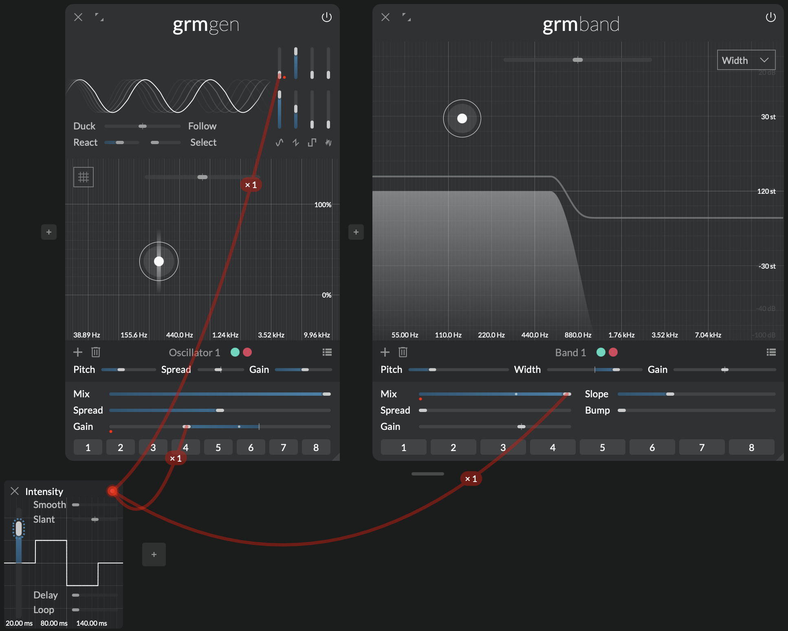
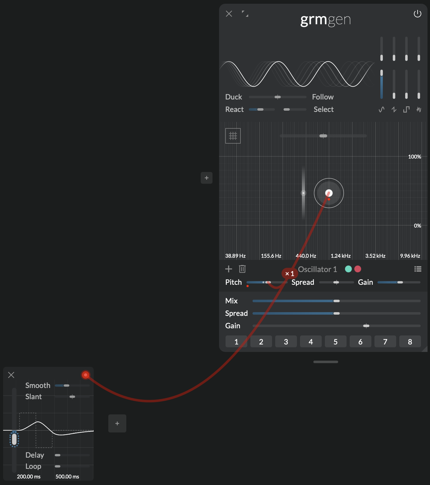

# MIDI and automations

_Remote control in your paw_

There are points where you want to get hands-on with your instrument. Be it for searching a sweetspot with your eyes closed or to perform a patch acting on multiple parameters at once. _Atelier_ provides a simple and straight forward way to map your hardware controllers, MIDI keys etc. to pretty much all controls you can see on screen; liberating you from the mouse and the necessity to look at the display.

In the context of a composition, when _Atelier_ is loaded as a [plug-in](../atelier/getting-started.md#use-as-a-plugin), automations can be used to control aspects of your patches evolving over time.

## Features

- Simple mapping of faders, knobs and MIDI keys to controls
- Feedback to hardware controllers with motorized faders or endless encoders
- Freely assignable automations for use in a DAW

## MIDI

_Atelier_ can be remote controlled by external MIDI control surfaces. You can use MIDI keyboards, fader banks, knob controllers, etc. to remotely control almost every slider or button in the application.

You can configure the MIDI devices in the [Audio and MIDI setup](../atelier/getting-started.md#application-audio-midi-setup). In the list of available MIDI devices select all MIDI devices that you want to use to control _Atelier_. If you have a MIDI control surface with motorized faders or endless encoders you can select it in **MIDI Output**. In this case whenever your change a patch or move a control using the mouse the hardware will reflect the current parameter value.

!!! note

    If you use _Atelier_ as a plug-in you might need to setup your DAW to forward MIDI messages to the track.

Once your setup is ready mapping a control is very simple:

1. Right-click on the slider or button you want to control to bring up the parameter menu.

2. Choose **Learn MIDI**.

   This will bring up the **Parameter mappings window** with the selected parameter highlighted.

   

3. Send a MIDI message by moving a fader, turning a knob or pressing a key.

   You will see a description of the MIDI event in the MIDI column of the mappings table. Click anywhere to exit MIDI learn mode and accept the controller assignment. Click on the trash bin icon if you want to abort.

!!! note
   
      If the hardware control was previously assigned to another parameter a warning icon will appear next to the MIDI event description. Hover with the mouse over the warning icon to see what parameter it was previously assigned to. Once you accept the new mapping the old one will be overwritten.

   If you want one controller to control several parameters just create a [Control](../modules/control.md) module and [set it up to control several parameters](#control-several-parameters-with-a-macro-control).

1. Once the mapping of a parameter is complete a dashed blue outline is drawn around the control to indicate that it is mapped.

## Automations (when used as plugin)

When used as a plug-in in a DAW you can automate parameters to record movements and schedule changes that should happen over time. Due to limitations of plug-in formats only a limited pre-defined number of parameters can be made available to DAWs for automation. _Atelier_ provides 64 'slots' of freely assignable automations that can be mapped to any control inside the plug-in. Mapped parameters can then be controlled from the DAW.

To expose a parameter to the DAW's automation system just right-click on the button or slider you want to automate. In the parameter menu choose **Automate Parameter**. _Atelier_ will automatically map the parameter to the next available automation slot. To indicate that a control is mapped its outline is highlighted with a dashed blue line. You can see what automation slot it is mapped to either by right-clicking on the control or by clicking the mappings button in the status bar to bring up the mappings window.

## The parameter mappings window

The parameter mappings window is the central hub for managing mappings to automations and MIDI controls. It is the place to correct automatically assigned automation slot, manually choose the desired MIDI event from a drop down menu or re-map a control with MIDI learn.

Hovering the mouse over the patch points at the beginning of each row will show a virtual cable helping you to find the mapped control. You can drag a wire from the patch point to a control if you want to re-map an automation and/or MIDI event to a different parameter.

As a shortcut to map parameters in quick succession there is a special patch point at the bottom of the window. Drag a cable from here to the control you wish to map. A new row in the mappings table will be created and **MIDI Learn** mode will be active for this parameter.

## Tips and tricks

### Control several parameters with a macro control

Sometimes it is desirable to control several parameters with a single hardware control or automation. You might for instance want to change the 'intensity' of a sound: increasing the gain at the same time as the complexity of its waveform. Just add a [Control](../modules/control.md) modulation and connect it to the parameters you want to control. Then map the **Value** parameter of the [Control](../modules/control.md) to an automation or a MIDI controller.

!!! note

      If you want the value of one parameter to decrease as the others increase you can change the modulation amount of a parameter to a negative number.

### Smooth low-res MIDI using Control

MIDI as a standard stood the test of time. But with its wide adoption comes the legacy of old digital systems. MIDI control change values only have a resolution of 7 bits. That means they can only adapt values between 0 and 127. While _Atelier_ applies a certain amount of smoothing to all parameters for some musical applications the low resolution output of MIDI controls might sound too 'step-y'. If this is the case you can create a [Control](../modules/control.md) module and map your controller to the **Value** parameter of [Control](../modules/control.md). Then set **Smooth** to 250ms. Create a modulation from [Control](../modules/control.md) to the desired parameter.
