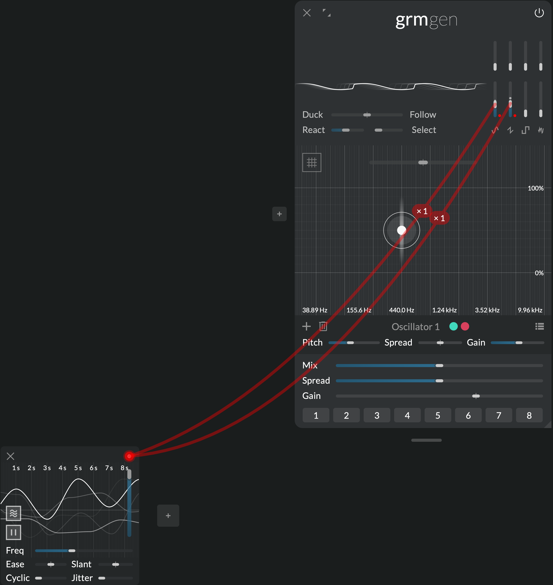
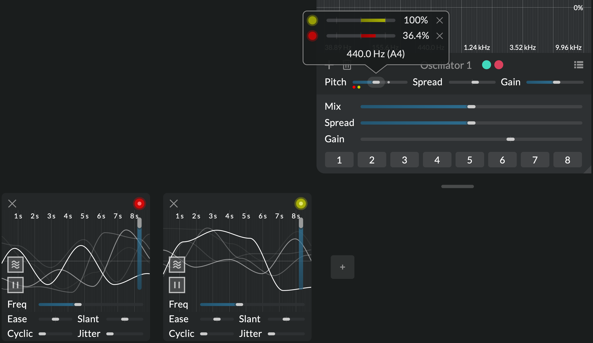
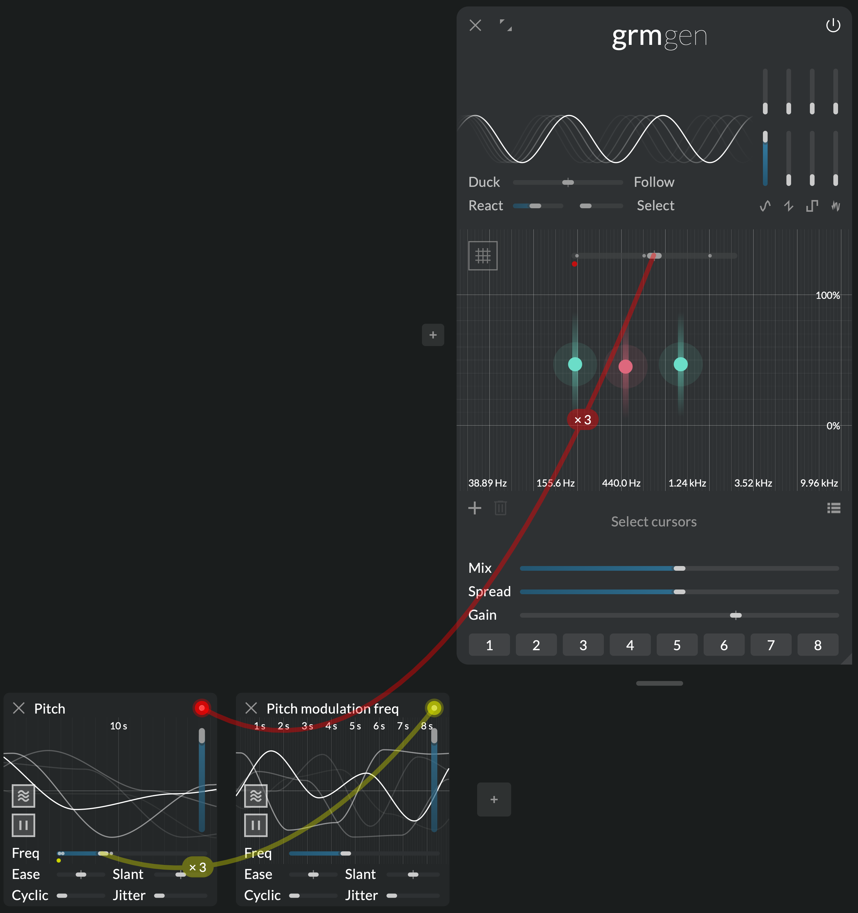
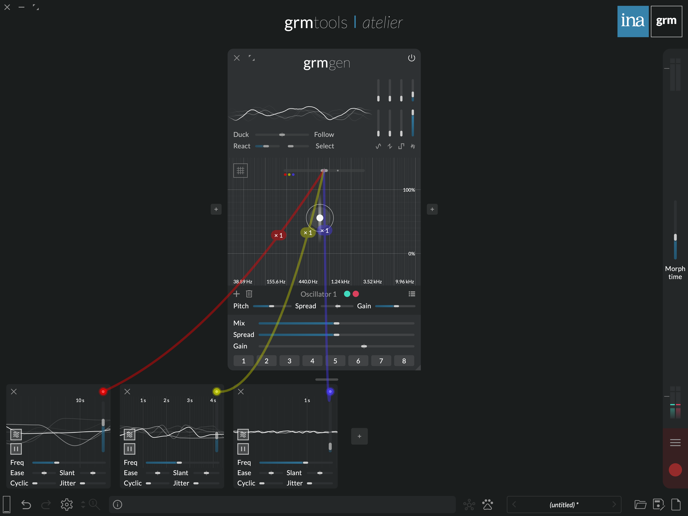
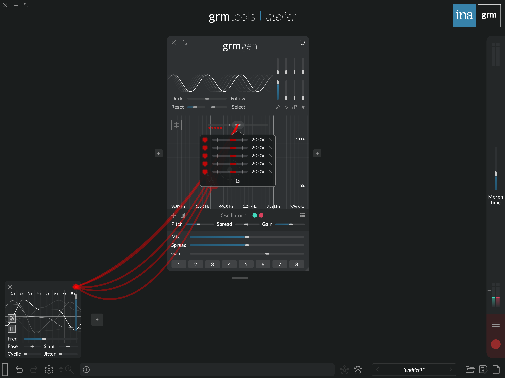

# The modulation system

_A new modulation paradigm_

In Atelier just like on modern modular synthesizers, all parameters (sliders, cursors, buttons etc.)
can be modulated. But Atelier's _polyadic_ modulation system goes far further than its analog
parent, offering a new paradigm to interact with your modules. It is the key to constructing living,
evolving patches, provoke surprises and program complex interactions.

Animate a whole family of parameters in one click, let complex random movements guide your
explorations ([_Agitation_](../modules/agitation.md)), construct tailor-made macro-controls for live
interaction ([_Control_](../modules/control.md)), or trigger advanced envelopes with customizable
contours ([_Peak_](../modules/peak.md))... If the modules of Atelier are its sound-processing heart,
the modulation system is certainly its brain.

## Features

- **Polyadic:** each destination is its own independent modulation engine
- **Accumulatable:** scale and sum as many modulations to a single parameter as wanted
- **Composable:** all modulators parameters are themselves modulatable, polyadically

## Getting started

Modulation is a classic technique from analog synthesis (also known as CV): instead of moving a
parameter manually, a _modulator_ generates a signal that moves it automatically. You may for
instance modulate the gain of some audio input with a sine LFO (low frequency oscillator) to get a
tremolo effect.

Click the "+" button in the bottom row of the interface to instantiate a modulator (e.g.
[_Agitation_](../modules/agitation.md)). Each modulator has a handle in the top right corner
(colored round); drag a wire from the handle to the parameter of your choice to make a new
connection.

Once a connection is made, the parameter is modulated relatively to its nominal value (the current
position of the slider, the state of the button etc.). Its actual value is displayed as a small grey
dot on sliders and buttons. Hovering over a modulated parameter shows a popup where one can scale
the modulation, or remove a connection.

Hovering over a modulator's handle displays its outgoing wires. Hold "w" or press the "Show all
connected wires" button in the status bar to see all wires.

!!! note

    You can give each modulator instance a name: click on the empty space between the "close" button and the colored handle. This helps remembering who does what.

## Polyadic modulation

In Atelier, all modulations are _polyadic_: if a modulator is connected to several destination
parameters, each destination gets its own independent modulation engine. Each of these modulations,
while sharing the modulator's parameters (speed, amplitude etc.), can have its own internal phase,
random state etc.

Try connecting the same modulator, say, an [_Agitation_](../modules/agitation.md), to two different
parameters: the two parameters will be agitated differently. Changing, say, the agitation's
frequency will act on the two parameters, but the random trajectories of each modulations will stay
independent.

This is in stark contrast with classic modulation in analog synthesis: if one was to patch a single
source of modulation (e.g. an LFO) into several destinations (by multing its output), each
destination would receive the exact same LFO signal. This new paradigm opens up a wealth of workflow
improvements and discovery avenues that would be difficult to imagine traditionally.

### Parameter instances

Moreover, when a single parameter actually controls several things at once, each of these things is
modulated independently: parameters can have several _instances_. For instance, the **Ratio** slider
in _Gen_ applies a ratio to all oscillators' frequencies; if there are three oscillators enabled,
**Ratio** has three instances: agitating **Ratio** will agitate the three actual ratios
independently.

The number of instances of a modulated parameter is shown on its wire (e.g. "x3"), and its actual
values are displayed as grey dots on the button/slider.

### Accumulating modulations

A parameter can receive several connections from several modulator (and even from the same
modulator). Just drag several wires to the same parameter; modulations are summed together, and the
parameter's popup displays the list of connections. Each connection has its own range (-200% to
200%).

!!! note

    The 100% range of all modulators is able to span the entire range of a parameter, either
    bipolarly (plus or minus half the range), or unipolarly (0 to full range). If at some point the sum
    of the nominal parameter value and all its modulations exceed the limit of the parameter, it is
    clamped to the limit.

!!! note

    On/off buttons (like _Play_'s play/pause buttons) can also be modulated, but they differ from
    continuous parameters: if the sum of their modulation is positive, their actual value is the same 
    as their nominal value (the state of the button); if it is negative, it is inverted.

### Modulating the modulators

All modulators parameters are themselves modulatable: just drag a wire from one modulator to another
modulator's parameter. These connections themselves are also polyadic: A modulator parameter has as
many instances as there are connections going out of it. In other words, if a modulator's parameter
is in turn modulated, each of its destination will spawn an individually-modulated modulator!

For instance, if three oscillator in **Gen** have their pitch modulated by the same agitation, and
another agitation modulates its frequency, then each of the three pitch modulations will see its
frequency agitated independently.

!!! note

    Because of their polyadic nature, modulation feedback loops do not make sense (they would
    require infinitely many parameter instances). The signal path of modulations must therefore be
    loop-free; Atelier will warn you whenever your patch involves a feedback loop.

## Tips & tricks

### Brownian agitation

Make 3 [_Agitations_](../modules/agitation.md), and set them up with increasing frequencies (say, 0.1
Hz, 1 Hz and 10 Hz) and decreasing amplitudes (say, 60%, 30% and 5%). Now modulate a parameter with
these three; the three agitations are summed together and result in a multi-scale agitation: large,
smooth movements are combined with smaller, faster one. Increasing the number of agitations
involved, we get closer and closer to what is known in physics as [brownian
motion](https://en.wikipedia.org/wiki/Brownian_motion) (see also [Perlin
noise](https://en.wikipedia.org/wiki/Perlin_noise)).

### Multiple connections

What happens if we connect a modulator, say an [_Agitation_](../modules/agitation.md), to the same
parameter multiple times, say 5 times? Each connection spawns an independent random oscillator, and
they are all summed together. Let's reduce the amplitude to 20% (1/5th of 100%) so it does not risk
clamping the parameter. The sum of all agitations is a random signal that has more chance to be
found around 0 (close to the nominal parameter value), much like rolling 5 dices and summing the
figures will get you a number likely close to 15 (5 * 6 / 2).

Got it? Now try to predict what will happen with a [_Peak_](../modules/peak.md) set to 50% chance of
triggering.
