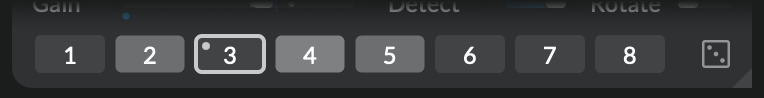

# Morphing

In _Atelier_ there are multiple ways for a patch or parts of it to transition from one state to another. Module snapshots for instance allow you to store and recall all cursors and parameters that make up a specific sound. Randomization on the other hand is a tool to leave the charted territories and embark on a journey to surprises by the roll of a dice.

These state changes can be instantaneous or continuously transition over time. Shifting shapes and **morphing** from one place to the other. All controlled by a single **Morph time** slider on the sidebar of the main window.

During such a transition _Atelier_ keeps a map of all effected parameter values of the current state and a map of the target values. It will continuously update the parameters with an interpolated value until it reaches the target. You can trigger several morphing operations simultaneously: The duration of each operation is determined by the value of **Morph time** at the moment you initiate it. This means that you could for example set **Morph time** to one minute, recall a snapshot in a module to initiate a very slow and gradual transition and then set **Morph time** to a much shorter value to randomize a few parameters. All the while the morphing snapshot recall is still on its way.

If you touch any of the effected parameters during a morphing operation that parameter will stay at the value you selected and won't be effected by the ongoing morph anymore.

!!! tip

    To smooth out movements controls such as sliders and cursors support **elastic drag**. Hold down `⌘` while dragging the control with the mouse to smoothly move it to the desired position. You can control the elasticity of the drag operation using the **Morph time** slider.

## Module snapshots

Each individual module in the effects chain has the ability to take snapshots of its current state. To take and store a snapshot of a module's parameters and cursor settings hold down `⌘` while you click on one of the eight buttons at the very bottom of the module. The selected button will light up indicating that there is a custom snapshot stored on its position. When you save your patch the snapshots will be saved alongside.

To recall a snapshot simply click on the corresponding number in the row of snapshot banks. Then the module will transition from its current state to the state stored in the snapshot. The duration of the transition can be adjusted with the **Morph time** slider on the sidebar of the main window. A little blinking dot in the corner of the snapshot button indicates an ongoing morph. It stops blinking once the morph is complete.

As is the case with most parameters in _Atelier_ you can automate and modulate the recalling of snapshots. You can thus turn snapshots into a living part of your patch; rhythmically or aleatorily invoking interesting scenes. Just experiment by dragging a wire from a modulation like [Agitation](../modules/agitation.md) onto the row of snapshot banks.

!!! note

    In its current version snapshots can't be exported to other patches or module instances. We are planning to add this feature in a future update.

## Randomizer

Randomization is a way to unstuck yourself, to find interesting settings you hadn't thought of before or just to sprinkle a bit of surprise on top of your patch. It works by automatically choosing a new random value for each effected parameter. Using the **Random amount** slider on the sidebar of the main window you can control how subtle or dramatic the randomization should be. The lower the amount, the closer the values will remain to their current position.

Randomization can be applied on different levels of your patch:

- If you want to randomize the entire patch click on the dice icon in the sidebar.

- To randomize only a specific module, click on the dice icon at the very bottom right of the module. This will generate new random values for all parameters within that module, while leaving the rest of your patch unchanged. Contrary to [module snapshots](#module-snapshots) randomization won't add or remove cursors.

- To randomize only a specific parameter right-click on the corresponding button or slider and choose **Randomize** from the parameter menu. Alternatively you can move the mouse over the control and press the `R` button on your keyboard.

!!! tip

    If you have several cursors selected and randomize one if its parameters randomization will be applied to the same parameter of the whole selection.

!!! warning

    Because randomization affects parameters like gain and feedback, patches may suddenly produce very loud sounds. Work with low headphone levels when using this feature!

## Locking

You can exclude certain parameters or whole modules from randomization or snapshot recalls using locks. Right-click on the control you want to lock and select **Lock**. A lock icon will appear next to the control indicating that it won't be effected by randomization or parameter recalls.

!!! tip

    If you have several cursors selected and lock one if its parameters the operation will be applied to the same parameter of the whole selection.

To exclude a whole module from randomization right-click on its title bar and select **Lock**.
