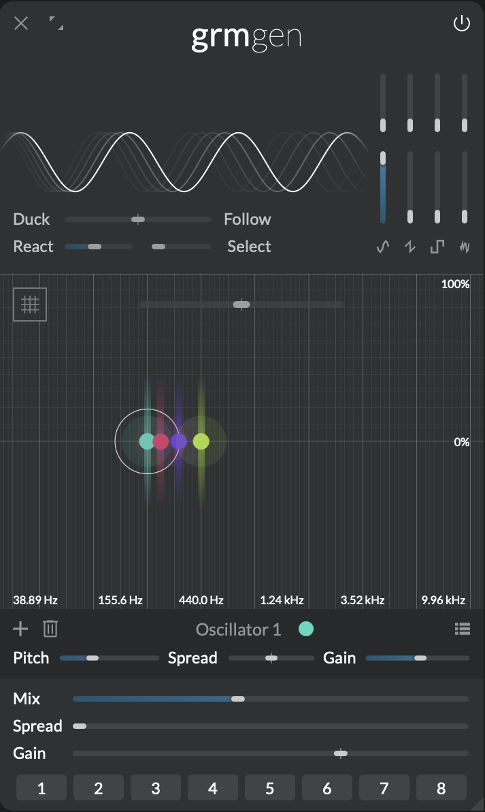
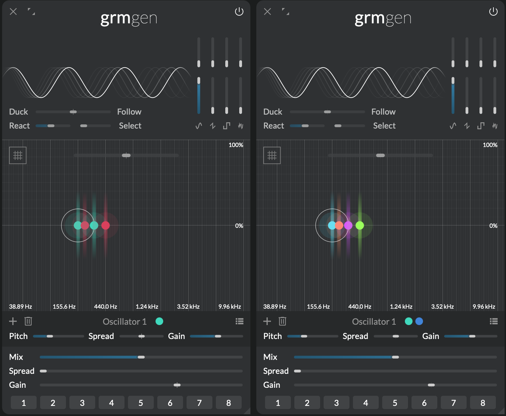

# Multichannel processing

!!! warning "This section is a **work in progress**"

Multichannel processing is part of _GRM Tools Atelier_'s core DNA. From its inception a flexible and adaptive performance in multi channel environments was one of the key design considerations. You can as easily compose for stereo setups as for quadrophony, octophony or 64+ channels. Even in a standard stereo setup _Atelier_'s unique design choices will by default produce outputs with wider stereo images than comparable tools.

A patch produced in one environment will automatically scale to fit any other setup. This adaptability holds precedence over surgical operations on a particular channel in a particular setup. Likewise _Atelier_ doesn't operate in specific surround formats or with assumptions about the acoustic space. Instead it delivers a set of discrete channels that can be easily mixed into the required format using well established tools.

## Features

- Deep integration of multichannel processing
- Over 64 input and output channels
- Automatic adoption of a patch created on one setup to a new environment
- Wide stereo images and movement in multichannel spaces by design rather than as a mixing afterthought
- A simple, efficient and easy to understand algorithm to distribute processing and input channels

## Multichannel processing in modules

Whenever you add a tone generator or a filter in a module each of them will automatically have one or more channels associated with it. For example: if you create a simple chord in [Gen](../modules/gen.md) each individual note of that chord will sound loudest on its corresponding channels. The actual distribution of those channels depends on the number of output channels of the application and the number of notes in the chord. Color-coding of _[cursors](???)_ is used to display the associated channels. You can get a more detailed overview by selecting a note. In the panel below the cursor area, next to the title you'll see circles representing the associated channels.

{: .screenshot }
!!! caption
    A four note chord in [Gen](../modules/gen.md) on a four channel system. The notes are displayed in the colors of the corresponding channels. Oscillator one is selected.

Similarly, if you add a filter in a processing module this filter will be applied to the associated input channels.

### Fanning and folding

In the case there are as many filters as there are channels it is easy: each filter gets one single channel. But what happens if the number of filters doesn't match the number of channels? This is where **fanning and folding** comes into play. It is a way of distributing channels ensuring that all channels are processed and all filters are applied. In essence if you have less filters than channels – under the hood – the filters are duplicated to match the number of channels. Conversely if you have more filters than channels the input channels will be duplicated and the output of the filters summed. This means that if you place for instance a single comb filter in [Comb](../modules/comb.md) at 440Hz all input channels will be resonating at that frequency. On the other hand if you have more filters than channels the filters process the channels in an alternating pattern.

{: .screenshot }
!!! caption
    Left: the same chord in [Gen](../modules/gen.md) on a stereo system. Right: and in an octophonic setup.

### Spread

To control the amount of channel-locality of each generator, playhead or filter most modules provide a **Spread** control. If **Spread** is at 0% they will only sound on their assigned channels. When the value is above 0% also filters that aren't assigned to a channel will be processed and mixed in by the specified amount. For instance if a [Comb](../modules/comb.md) module had two filters at different frequencies and **Spread** is at 50% the filter assigned to the processed channel would sound at full gain while the other filter would only sound at half the loudness. Cursors that visually represent a generator, playhead or filter in a module are drawn using colors representing the assigned channels. The higher the **Spread** amount is the whiter cursors will appear in the cursor area.

Note that the **Spread** parameter has as many [parameter instances](modulation.md#parameter-instances) as there are cursors. Meaning that when you modulate **Spread** each filter has its own spread value and will "bleed" to other channels accordingly.

## Setup

<!--
TOC

- philosophy
  - limits (or lack thereof)
  - automatic adoption of patches to current setup
    - rather than surgical operation on channels that make sense only in the context of
      current setup
  - perfect for spacial composition
  - context: acousmonium?
  - discrete vs. surround format
- features
- cursor has one or more channels
  - screenshot comb 4 ch 
  - selecting a cursor will show the "assigned" channels
    - screenshot of panel
  - colors mix to white
  - fanning & folding
  - spread
    - colors
- # of channels match # of output channels
  - settings in standalone
  - as a plugin: adjusts to track layout as setup in DAW
-->

<!-- fanning & folding -->
<!-- channel # for modules = # outputs -->
<!-- play file read: maybe should go to play.md instead with a reference to multichannel#fanning&folding? -->
