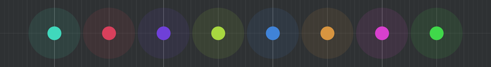
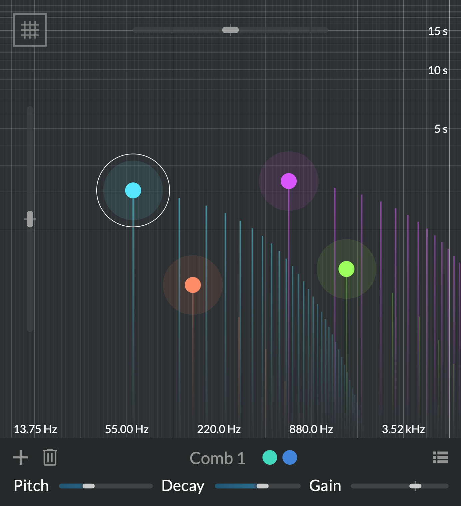

# Multichannel processing

Spatial thinking is often put aside during composition, and left as a mixing afterthought. Where most creative audio tools only work in mono or stereo, _Atelier_ brings spatial decisions to the composition stage. Want to process mono sound? Fine. Want to render your generative patch on a 32-channel loudspeaker dome? Works too. There are no limits other than your available CPU.

Essentially, _Atelier_ does not care how many channels you use, nor makes any assumption where they are placed. All processors apply the same processing on all the channels. The result can then be downmixed or spatialized into the required format using [any](https://plugins.iem.at/) [available](https://inagrm.com/en/store/product/15/spaces) [tool](https://forum.ircam.fr/projects/detail/spat/). Therefore, a patch produced in one setup will automatically scale to fit any other setup, following a few simple rules.

## Setup

The number of _outputs_ set up determines how many channels processors work with.

- In the app, set it in the [Audio and MIDI configuration](getting-started.md#application-audio-midi-setup).
- The plug-in adapts to the numbers of channels of the track it is instantiated on.

If the number of inputs and outputs differ, [fanning and folding](#fanning-and-folding) is applied to distribute the channels as evenly as possible. For instance, the mono input from a microphone will be distributed on all output channels.

## Channel colors

Throughout the system, channels are identified with specific colors (Ch. 1 is green, 2 is red etc.).

{width=65%}

They are chosen so that their superposition is always white. Therefore, throughout _Atelier_, a saturated color identifies a specific channel, and the closer to white it gets, the more it represents a blend of several channel. White means "all channels".

## Spread

Throughout _Atelier_, the **Spread** parameter is your key to distributing processors to channels. It controls _channel locality_: focused on some channels vs. spread out to all.

{width=50%, align=right}

Single processing units (a generator, a comb filter etc.) are represented by _cursors_: round, colored dots. Each cursor automatically gets assigned one or more channels by [fanning and folding](#fanning-and-folding). These are visible in the dark panel below when a cursor is selected, next to its name.

The **Spread** parameter determines what channel each unit (here, comb filter) processes:

- When **Spread** is 0%, the processing is fully local to its assigned channels. Here, **Comb 1** will only process Channels **1** and **5**.
- When **Spread** is 100%, all channels are processed the same way. Here, each of the 4 comb filters processes each channel, and the result is mixed per channel.

!!! note

    This assignment is not editable. It is what makes this system adaptive to any I/O configuration.

## Fanning and folding

Then how are channels assigned to units?

!!! warning "This section is a **work in progress**"

In the case there are as many filters as there are channels it is easy: each filter gets one single channel. But what happens if the number of filters doesn't match the number of channels? This is where **fanning and folding** comes into play. It is a way of distributing channels ensuring that all channels are processed and all filters are applied. In essence if you have less filters than channels – under the hood – the filters are duplicated to match the number of channels. Conversely if you have more filters than channels the input channels will be duplicated and the output of the filters summed. This means that if you place for instance a single comb filter in [Comb](../modules/comb.md) at 440Hz all input channels will be resonating at that frequency. On the other hand if you have more filters than channels the filters process the channels in an alternating pattern.
