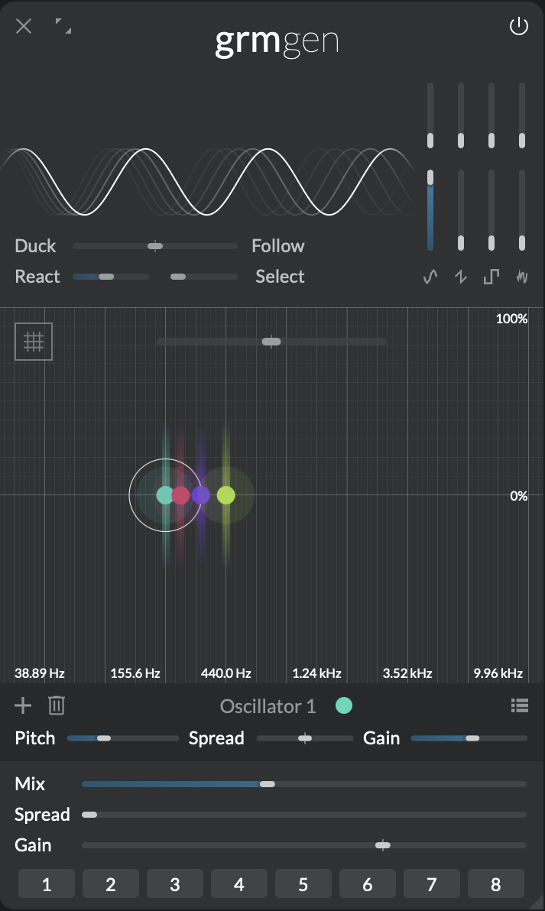

# Multichannel processing

!!! warning "This section is a **work in progress**"

<!-- no limit other than CPU -->
<!-- agnostic and discrete -->
<!-- space at composition -->

Multichannel processing is part of _GRM Tools Atelier_'s core DNA. From its inception a flexible and adaptive performance in multi channel environments was one of the key design considerations. You can as easily compose for stereo setups as for quadrophony, octophony or 64+ channels.

A patch produced in one environment will automatically scale to fit any other setup. This adaptability holds precedence over surgical operations on a particular channel in a particular setup. Likewise _Atelier_ doesn't operate in specific surround formats or with assumptions about the acoustic space. Instead it delivers a set of discrete channels that can be easily mixed into the required format using well established tools. For example [iem](https://plugins.iem.at/) or GRM's own [new spaces](https://inagrm.com/en/showcase/news/598/nouveaux-spaces).

<!-- channel colors -->

## Multichannel processing in modules

Whenever you add a tone generator or a filter in a module each of them will automatically have one or more channels associated with it. 

{width=50%, align=right}

For example: if you create a simple chord in [Gen](../modules/gen.md) each individual note of that chord will sound loudest on its corresponding channels. The actual distribution of those channels depends on the number of output channels of the application and the number of notes in the chord. In [Gen](../modules/gen.md) note oscillators are represented using 'cursors' on a grid. These are color-coded to display the associated channels. You can get a more detailed overview by selecting a note. In the panel below the cursor area, next to the title you'll see circles representing the associated channels.

Similarly, if you add a filter in a processing module e.g. in [Comb](../modules/comb.md) or [Band](../modules/band.md) or a delay tap in [Time](../modules/time.md) this filter will be applied to the associated input channels.

### Fanning and folding

In the case there are as many filters as there are channels it is easy: each filter gets one single channel. But what happens if the number of filters doesn't match the number of channels? This is where **fanning and folding** comes into play. It is a way of distributing channels ensuring that all channels are processed and all filters are applied. In essence if you have less filters than channels – under the hood – the filters are duplicated to match the number of channels. Conversely if you have more filters than channels the input channels will be duplicated and the output of the filters summed. This means that if you place for instance a single comb filter in [Comb](../modules/comb.md) at 440Hz all input channels will be resonating at that frequency. On the other hand if you have more filters than channels the filters process the channels in an alternating pattern.

<!-- screenshot -->

### Spread

To control the amount of channel-locality of each generator, playhead or filter most modules provide a **Spread** control. If **Spread** is at 0% they will only sound on their associated channels. When the value is above 0% also filters that aren't assigned to a channel will be processed and mixed in by the specified amount. For instance if a [Comb](../modules/comb.md) module had two filters at different frequencies and **Spread** is at 50% the filter assigned to the processed channel would sound at full gain while the other filter would only be half as loud. Cursors that visually represent a generator, playhead or filter in a module are drawn using colors representing the assigned channels. The higher the **Spread** amount is the whiter cursors will appear in the cursor area.

Note that the **Spread** parameter has as many [parameter instances](modulation.md#parameter-instances) as there are cursors. Meaning that when you modulate **Spread** each filter has its own spread value and will "bleed" to other channels accordingly.

## Setup

The numbers of channels in modules is equal to the number of output channels of the application. The hardware output channels can be configured in the [Audio and MIDI Setup](getting-started.md#application-audio-midi-setup). The number of input channels may differ from the number of output channels. In this case the [fanning and folding](#fanning-and-folding) technique described above is applied to distribute the channels as evenly as possible. That means for instance that the mono input from a microphone will be available on all channels.

When _Atelier_ is used as a plug-in it automatically adapts to the numbers of channels of the track it is instantiated on.
