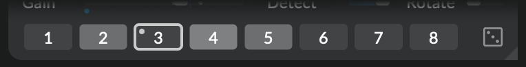
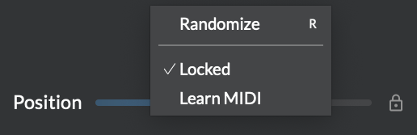

# Snapshots and randomizer

Easily store and recall the state of a whole processor in one click with _snapshots_. Leave creative decisions to chance and get inspired by surprise with the _randomizer_. All of this instantaneously, or continuously transitioning over time with _morphing_. Shifting shapes, unpredictable destinations... _Atelier_ is about the journey as much as the result.

## Snapshots

Each processor features a bank of eight snapshots at the bottom of its interface:

{width=65%}

To capture a snapshot, `⌘`-click on one of the eight snapshot buttons; it lights up, indicating that it contains a custom snapshot. Snapshots are saved with your patches. Each instance of a module has independent custom snapshots.

!!! note

    Snapshots include all sliders, buttons and cursors position, and certain other data like the file loaded in _Play_, or the widget sizes in _Viz_.

To recall a snapshot click on its button. The processor's parameters start [morphing](#morphing) from their current state to the state stored in the snapshot. A white outline around a button indicates the currently-selected snapshot; when any parameter is manually moved, the outline becomes grey, as a reminder of the last selected snapshot.

The currently-selected snapshot (from 1 to 8) is itself a parameter, and therefore modulatable and mappable: just draw a cable to the snapshots area. A little dot in the corner indicates its actual value; it blinks while in transition. This way you can control or randomize the invocation of pre-saved scenes.

## Randomizer

{align=right width=7%}

Randomization is a way to find new ideas, or just sprinkle a bit of surprise on top of your patch.
When randomized, a parameter start [morphing](#morphing) from its current value to a new random
value. You can randomize:

- **A single parameter** by right-clicking or pressing `R` while hovering it,
- **A group of parameters** by selecting several cursors, and pressing `R` while hovering over one of their sliders in the panel below,
- **A whole processor** by clicking **Randomize** (dice icon) next to the snapshot buttons
- **A whole patch** by clicking **Randomize** (dice icon) in the sidebar

Contrarily to [snapshots](#snapshots), randomization won't add or remove cursors; add the desired cursors before randomizing.

!!! tip

    The processor-level **Randomize** button is itself modulatable and mappable. The patch-level **Randomize** button is only mappable.

The **Random amount** slider in the sidebar controls how subtle or dramatic the randomization will be. The lower the amount, the closer the new random value will remain from the current one. 100% makes the new value completely random.

!!! warning

    Because randomization affects parameters like gain and feedback, patches may suddenly produce very loud sounds. Work with low headphone levels when using this feature!

## Locking

{align=right width=45%}

You can exclude certain parameters from randomization or snapshot recall using locking. Right-click on a control or on a module's title bar and select **Lock**. Locked parameters are:

- not randomized,
- not recalled when recalling a snapshot,
- not saved when saving a snapshot.

By locking some parameters and saving a snapshot, you therefore save a "partial" snapshot that will leave some parameters as-is when recalled (even if they are unlocked afterwards).

## Morphing

Both snapshot recall and randomization smoothly morph from the current state to the new one, by interpolating each parameter separately. The **Morph time** slider in the sidebar sets this transition time.

If you modify any affected parameters during morphing, it stops morphing. The morphing duration is determined by the value of **Morph time** at the moment you initiate it. You could for example set **Morph time** to one minute, trigger a recall, then set **Morph time** to a much shorter value to randomize a few other parameters.

## Elastic drag

{align=right width=45%}

To ease smooth movements, sliders and cursors also support **elastic drag**. Hold down `⌘` while dragging the control to smoothly move it to the desired position. You can control the elasticity of the drag operation using the **Morph time** slider.
