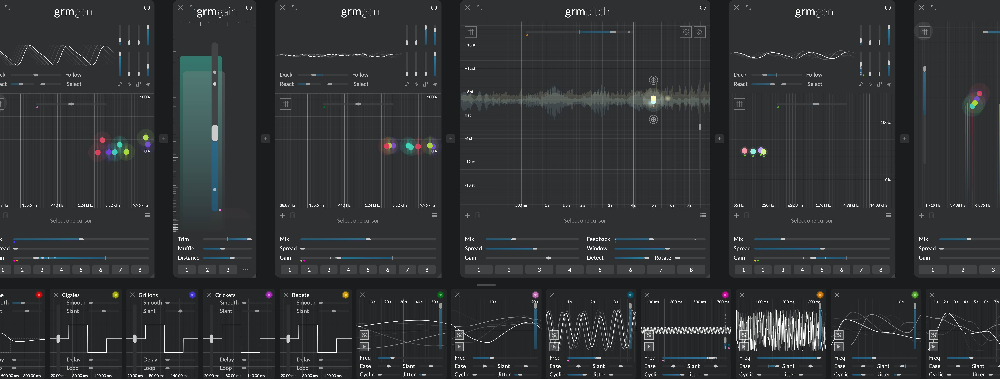

# Atelier

_Creative Audio Workbench_

## Patch, play, discover

_Atelier_ is a sandbox for the curious, a platform for exploring endless sonic ideas. Modular at its
core, multichannel from the ground up, it is the modern tool for all sound adventurers. _Atelier_
doesn't hand you the sound: it gives you everything you need to uncover it yourself.

Standing on decades of research in audio signal processing and electronic lutherie, _Atelier_ is the
new software platform of the GRM Tools series, coming straight from INA GRM's research & development
department and developed in close connection with GRM's avant-garde composers and sound designers.

## What's in the box

_Atelier_ is a standalone application and a plugin for DAWs (VST3, AUv2, AAX) for macOS (Windows
support coming soon). Atelier comprises a set of _modules_, which are freely chainable and
connectible:

* **Processors** which generate or transform sound, and
* **Modulators** which generate modulations, freely assignable to any parameter

## Features

* **Polyadic Modulation Engine:** A novel modulation paradigm: organic and per-voice control, making
  it fast and expressive to build complex, evolving patches. Everything modulatable, no artifacts.
* **Full Multichannel Support:** Create in stereo, quad, or 64+ channels without changing how you
  work. Perfect for spatial composition.
* **Groundbreaking yet simple modules:** From granular delays to multi-playhead samplers, modules
  are simple and understandable, yet reward curiosity and creative misuse.
* **Hybrid Workflow:** Sound generation and processing in one place; build an advanced synth, a
  granular FX chain, or something never seen before.
* **Parameter Morphing:** Transition between module presets or randomize parameters with smooth
  sonic interpolation, ideal for performance, evolving patches or simply to be surprised.

## Philosophy

* **By enthusiasts, for enthusiasts:** Like you, we are all passionate musicians and curious minds.
  We exchange every day with avant-garde electronic music composers at GRM. _Atelier_ is built by a
  small and dedicated team inside a public institution. Our favorite question is "what if?". We have
  a unique goal: make the universally-accessible instrument we are dreaming of. No music knowledge
  required, no market considerations: all decisions taken by enthusiasts, for enthusiasts.
* **The magic is in the making:** true to Pierre Schaeffer's founding principles of composing by
  directly interacting with the musical material ("Le faire et l'entendre"), everything in _Atelier_
  is real-time, interactive and modulatable. No forethought necessary, be guided by what you hear.
* **Just tools:** Every module has simple and easy to understand functions: everything is observable
  and documented, nothing is a black box; there is no wrong way to use them. Just by playing, you
  will learn how things work, and discover new uses for the tools. Keep it simple or build something
  complex; we are just giving you the tools to do so.
* **Functional user interface:** The UI never gets in the way: every element on screen has an
  informative function, and no menu or tabs hides important information. A single screenshot should
  be enough to get a grasp of a patch.
* **Classics, reinvented:** _Atelier_ is a reinvention of the venerable GRM Tools suite: while
  respecting and preserving the underlying philosophy, it bears no single line of code in common
  with its older sibling.

## The beginning of a beautiful friendship

_Atelier_ is built to grow. As we develop new features it will evolve over time, including new
modules, processors and modulators, and new core features. Your purchase of _Atelier_ `v1.x` is a
lifetime purchase: no subscription, no recurring fees. It includes all features that will be
introduced in point-updates, i.e. about 1.5—2 years worth of upgrades. When `v2.0` is released, we
will propose discounted upgrade paths for existing `v1.x` user.
