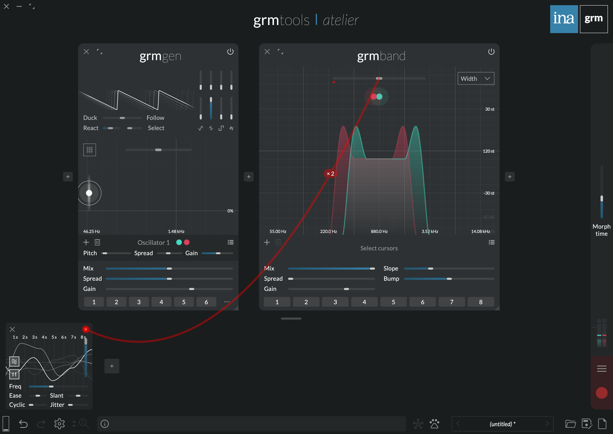
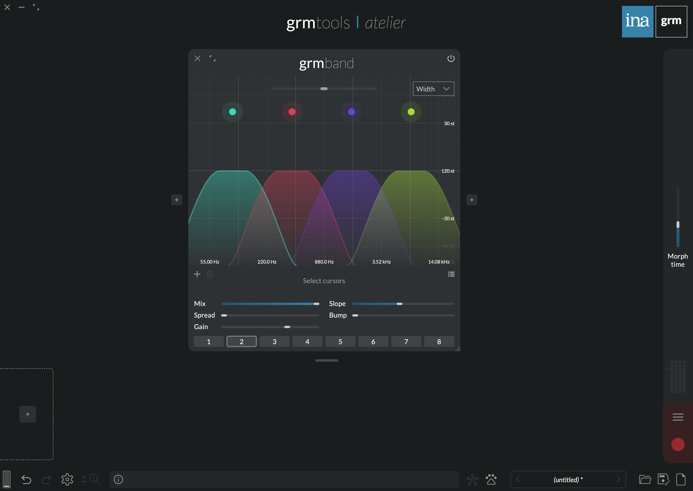
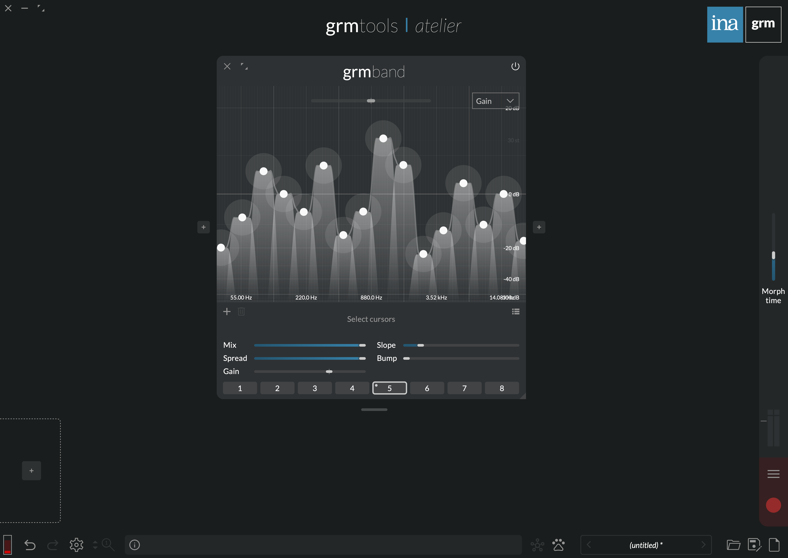

Spectral scalpel
{.tagline}

# {.module-logo} Band

!!! warning "This section is a **work in progress**"

{.main-pic}

## Features

- Precise multi-band filter with up to 16 spatializable bands
- Continuous slope setting for razor-sharp selectivity or gentle pushes
- Adjustable formant-shaping bumps at transition frequencies
- Band-pass or band-reject modes per band

## Context

<!-- note: latency -->
<!-- note: FFT -> linear phase, artifact -->

---

## Controls

### Cursor Area

Click to add a band; double-click a band to remove it. Each band is visualized by a color gradient
of its assigned channels colors (see [Spread](../atelier/multichannel.md#spread)). Each channel's
frequency response is visualized by a thick, solid line.

- **Y axis parameter:** The combo box determines which parameter is displayed on the Y axis (and
  consequently which is displayed on the Z axis, ie. cursors' halo size): either **Gain** or
  **Width**.

Each band has three parameters:

- **Pitch (X axis):** Center frequency of the band
- **Width (Y or Z axis):** Width of the band, in semitones. Positive width means band-pass, negative width means band-reject.
- **Gain (Z or Y axis):** Gain of the band

- **Transposition:** Transposes all bands center frequencies. This parameter has as many
  independently-modulatable instances as there are bands (see
  [Modulation](../atelier/modulation.md)).

### Global controls

- **Mix:** Crossfades the dry signal (0%) with the wet signal (100%).

The following parameters have as many independently-modulatable instances as there are bands (see [Modulation](../atelier/modulation.md)).

- **Spread:** Channel-locality of each band. At 0%, each band processes only the channels it is
  assigned to (see the global [Spread](../atelier/multichannel.md#spread) section); at 100%, all
  bands process all channels in parallel (multi-mono).
- **Gain:** Global gain of all bands.
- **Slope:** Number of semitones to transition from cutting to passing, and conversely.
- **Bump:** Adds a bell-shaped boost at the transition frequencies. The bump's width is determined
  by **Slope**, and its height is in ratio of the gain.

---

## Tips and tricks

### Animated formants

Feed _Band_ with a ~50Hz sawtooth wave e.g. from _Gen_. Add a few bands in the middle, with
**Width** around 15st, **Slope** around 6st, and **Bump** around 1x. Make an agitation, and agitate
**Transposition**: The two bands agitate independently, producing evolving guttural drones. A cheap thrill.

### Band splits

{width=40%, align=left}

_Band_ can split a signal into disjoint bands, for further independent processing. Add as many bands
as there are channels, and adjust **Slope** to taste. Place them so that they sum to zero: For this,
temporarily set **Spread** to 100%, make the frequency response (solid white line) as flat as
possible, then set **Spread** back to 0%. You can follow _Band_ with e.g. a _Pitch_ instance, to
pitch-shift and/or delay each band by a different amount.

Factory presets 2 or 3 illustrate this technique.

### Graphic equalizer

{width=40%, align=left}

Make a few bands covering the whole spectrum and summing to zero (see [previous tip](#band-splits)),
with **Spread** at 0%. A slightly increased **Slope** will smoothen the bands and reduce ringing.
Now display Gain on the Y axis (**Y axis parameter**), and adjust the gain of each band as desired.
Use the Option key to lock the X axis when dragging a band. You now have a graphic equalizer.

Factory presets 4 and 5 illustrate this technique.
