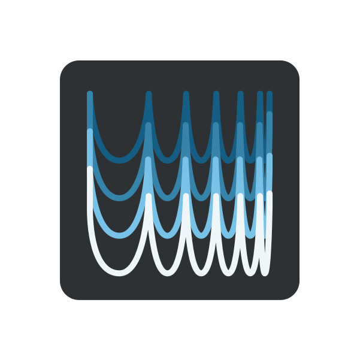
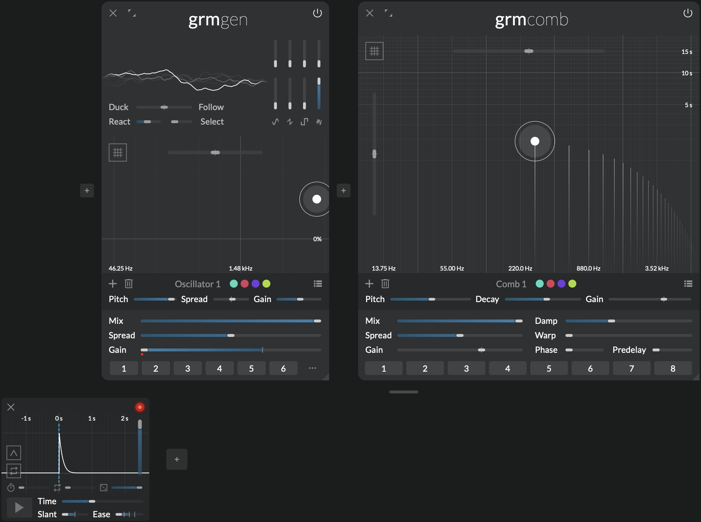
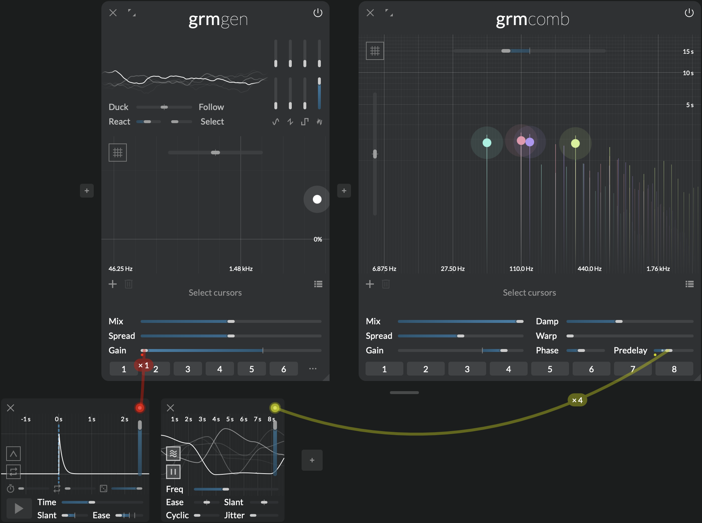
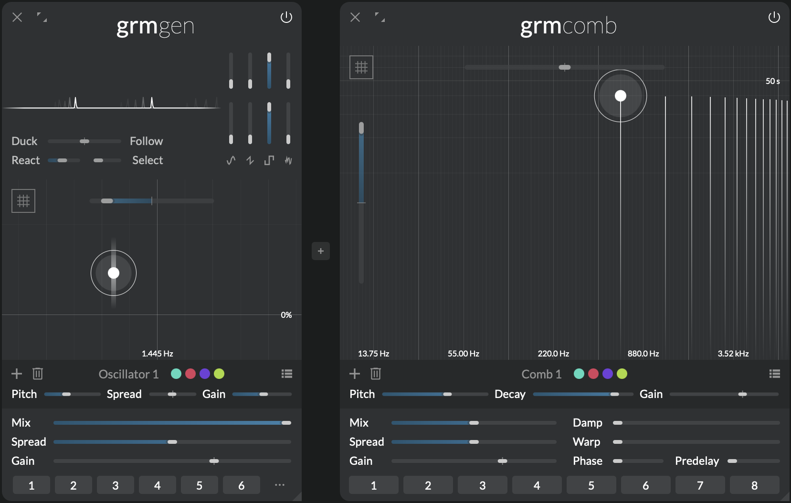
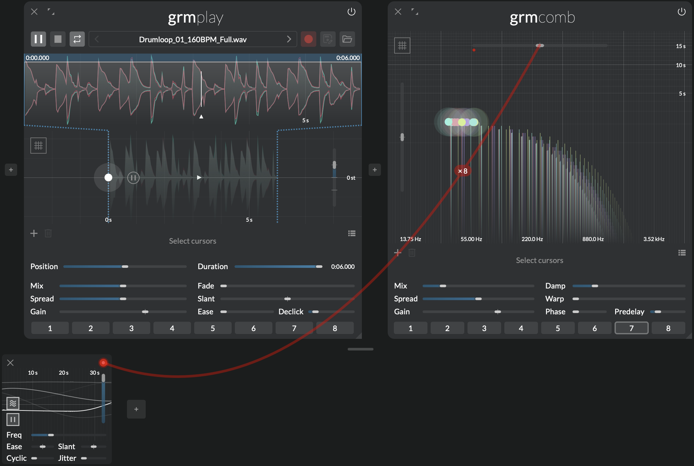
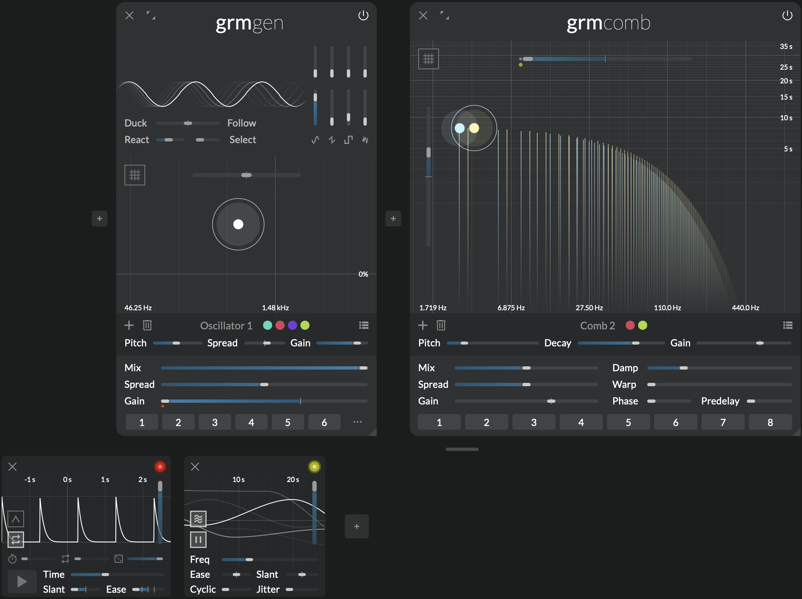

Resonance treasure trove
{.tagline}

# {.module-logo} Comb

{.main-pic}

The comb filter is arguably the most basic building block of signal processing. Let's turn it into a creative tool! With a handful of carefully-chosen additions, _Comb_ makes a simple component into it a fun and versatile physical modeling-inspired instrument with wide sonic possibilities: subtle coloring, massive reverberations, nuances of wooden or metallic tones... Whether used as an end-of-chain effect or as an integral synthesis block, _Comb_ is a resonance treasure trove.

## Features

- Bread-and-butter, reinvented: from simple delay line to complex evolving tones
- Multiple, precisely tunable comb filters with independent controls
- Advanced physical modeling-inspired parameters for a wide sonic palette

## Context

A comb filter is simply a very short delay with feedback. It mimics what happens in nature when sound bounces back and forth between two surfaces; it is what makes the particular sound of a physical enclosure (instrument, room...).

As the delay gets shorter, we stop perceiving the repeats as echoes, and start hearing them as pitches: the shorter the delay, the higher the pitch. If, just as in nature, we shave off some of the high frequencies at each repetition, the tone gets more mellow over time, simulating the propagation of a wave along a string. Fed with bursts of noise, this is often called _Karplus-Strong_ synthesis. _Comb_ takes this classic to new _digital waveguide_ territories with precise control over damping, unique inharmonic warping of partials and pick-up positioning for interesting phasing effects.

---

## Controls

### Cursor area

Click to add a comb filter; double-click a comb filter to remove it. Each comb filter processes each input channel; they run in parallel and are mixed to the output.

Each comb filter has three controls:

- **Pitch** (X axis): Resonance frequency.
- **Decay** (Y axis): Decay time to -60dB. If the decay time is set to more than 20 sec, the decay is infinite: fed with a short impulse it will ring forever.
- **Gain** (Z axis): Output gain of the comb filter.

The following parameters have as many independently-modulatable instances as there are comb filters (see [Modulation](../atelier/modulation.md)).

- **Transposition:** Transposes all comb filters by a given amount of semitones.
- **Decay scale:** Scales all decay times.

Finally the **Quantize** button quantizes all filter frequencies to the closest semitone.

### Global controls

- **Mix:** Crossfades the dry signal (0%) with the wet signal (100%).

The following parameters have as many independently-modulatable instances as there are comb filters (see [Modulation](../atelier/modulation.md)).

- **Spread:** Channel-locality of each comb filter's processes. At 0%, each comb filter processes only the channels it is assigned to (see the global [Spread](../atelier/multichannel.md#spread) section); at 100%, each comb filter processes all channels in parallel (multi-mono).
- **Gain:** Output gain of all comb filters.
- **Damp:** Amount of damping, or how much high frequencies are attenuated as decay progresses. At 0%, no damping is applied, leading to metallic tones; at 100%, the filter rapidly converges to the resonance frequency.
- **Warp:** Warps the resonance partials, from purely harmonic (0%) to weirdly dissonant. It works by introducing a complex all-pass filter in the feedback loop, delaying some frequencies more than others at each round-trip.
- **Phase:** Controls where in the delay loop the output signal is picked up, i.e. only at the end (0%) or in the middle as the sum of the forward and backward direction (100%). At 100%, phase cancellations are such that only odd harmonics ring.
- **Predelay:** Introduces a short delay before the input signal hits the comb filter loop.

---

## Tips and tricks

### Noise bursts

_Comb_ shines with transient-rich input material. Using [Gen](gen.md) and [Peak](peak.md), make short bursts of noise. Follow with a single comb filter at a relatively high **Decay** (>1s); put **Mix** at 100%, and adjust **Damp** and the noise's length and color to taste to get a wide variety of plucked strings, glassy tone, bell sounds etc.

### Strummed chords

Building on the previous tip, add more comb filters at different frequencies to make a chord. Now, put **Predelay** around 50ms, and modulate it slightly with a slow [_Agitation_](agitation.md). Every filter will get its own randomly-evolving predelay, resulting in a "strumming" effect, as if strings were not plucked all at the same time.

### Infinite decay

When **Decay** is set to more than 20 sec and **Warp** is 0%, decay is _infinite_: any short-lived input will resonate (almost) forever. Fed with an initial short signal, this can be useful to generate held tones, drones or textures.

!!! note

    Infinite decay works only if either **Damp** or **Warp** is 0% (one of the two).

### Crude reverb

Early digital reverberation units (now refered to as [Schröder reverbs](https://ieeexplore.ieee.org/document/6161610)) worked by simply feeding the input signal through several dampened comb filters in parallel. With **Mix** around 20%, make a cloud of a dozen comb filters with frequencies around 20-50 Hz (the ear's integration time). Set **Damp** around 20% will get you a relatively natural reverberation, where the global decay time controls the reverb time (Snapshot 7). Adjust **Predelay** to taste; slightly and slowly agitating **Transpose** will help attenuating some the metallic resoance.

### At time rate

A comb filter is a very short delay... but _Comb_ also does longer delay! These will be heard as normal repetitions, so you can use _Comb_ as (a set of) regular delays, with some twists. Add a single comb filter towards the lower frequencies, and put **Transposition** all the way down; you can reach delay times up to about half a second (2 Hz). **Decay** then controls the delay feedback, and the other controls well... you will have to experiment for yourself! Remember that everything (especially frequency/delay time) is modulatable.
