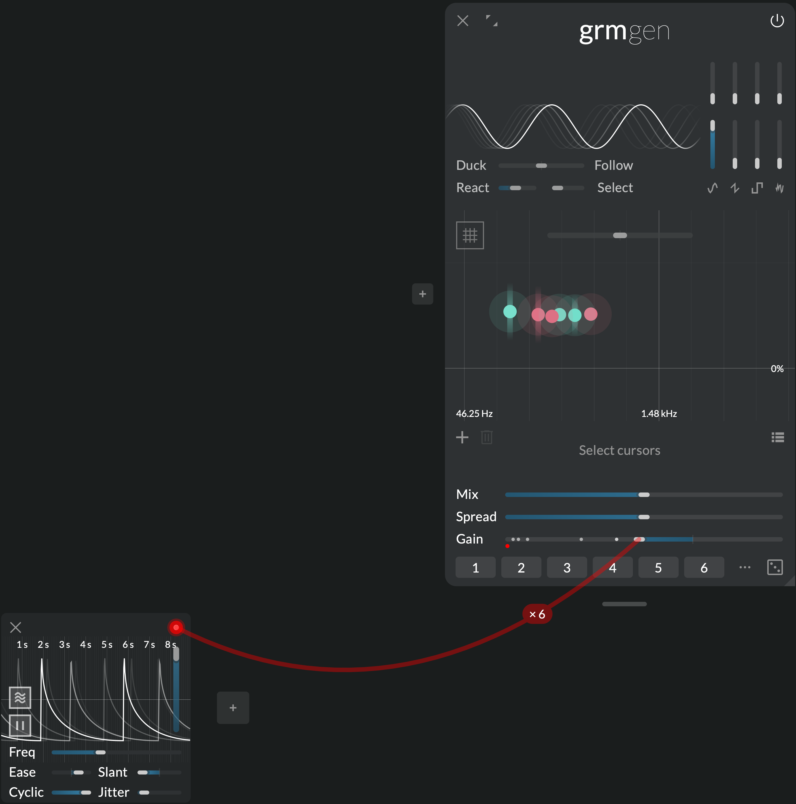
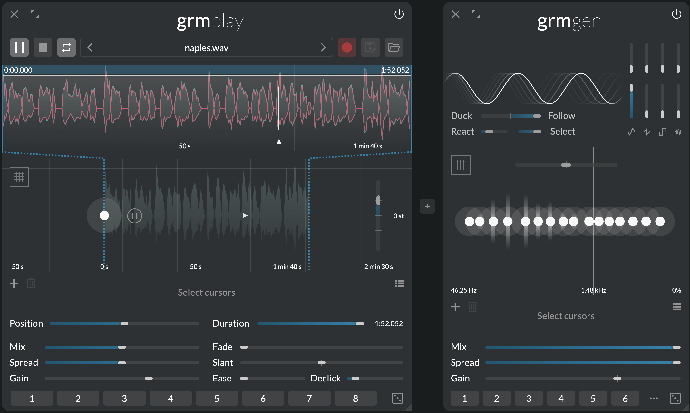
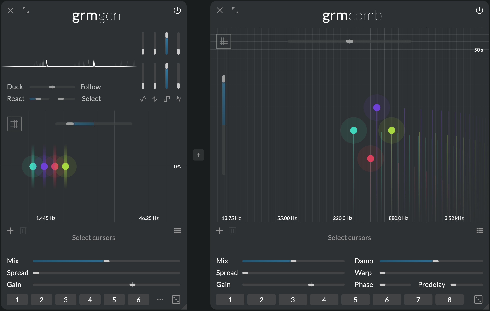

Where signals spring
{.tagline}

# {.module-logo} Gen

{.main-pic}

All music stems from a simple tone, a simple vibration through time. Shaped, attenuated or multiplied, modulated or processed, it gradually becomes noise, texture, melody, or symphony. _Gen_ is where music starts: a simple yet versatile signal generator bank, with traditional waveforms and input analysis features. A world of generative possibilities.

## Features

- Bank of independent signal generators (up to 16) spreadable through the multichannel space
- Four mixable waveforms per generator, each with a different morphing parameter
- Input envelope follower for gain following or ducking

## Context

In the pure tradition of modular synthesizers, and before them the test equipment used creatively by the pioneers of electronic music, _Gen_ is a bank of complex signal generators. As soon as a generator is activated by clicking in the [cursor area](#cursor-area), it sounds continuously until stopped. No MIDI note or triggering events required, no duration.

_Gen_ can therefore be used to easily generate complex evolving drones, but it can be modulated so as to create triggerable discrete events or generative, random tones. All generators share the same complex waveform, chosen by mixing and warping the signals of four oscillators available in the [waveform area](#waveform-area):

- **Sine** with phase modulation
- **Triangle** with slope control
- **Rectangle** with pulse width control
- Filtered **noise** with filter control (from low-pass to band-pass)

Just like all processors, _Gen_ takes sound as input. This input can be passed through unaffected, and mixed with the generators (**Mix**), but can also influence them: each generator embeds an independent [envelope follower](#envelope-follower-section), able to modulate its own gain depending on the amplitude of the input, opening up adaptive reactions, and basic resynthesis.

---

## Controls

### Waveform area

All parameters in the waveform area have as many independently-modulatable instances as there are generators (see [Modulation](../atelier/modulation.md)).

- **Sine gain:** Gain of the sine oscillator.
- **Triangle gain:** Gain of the triangle oscillator.
- **Rectangle gain:** Gain of the rectangle oscillator.
- **Noise gain:** Gain of the filtered noise generator.
- **Sine timbre:** Amount of sine phase modulation.
- **Triangle timbre:** Morphs from saw to triangle wave.
- **Rectangle timbre:** Rectangle pulse width. Morphs from square wave to single-sample impulse.
- **Noise timbre:** Morphs from low-pass-filtered to resonant band-pass-filtered white noise.

#### Envelope follower section

- **Duck/Follow:** At 0%, all generators are constantly on. At positive values (Follow), each generator gain follows more-and-more the amplitude envelope of the input signal. At negative values (Duck), each generator gain is reduced more-and-more when the envelope of the input signal increases.
- **React:** Envelope follower reactivity, or time it takes for the envelope follower to rise or fall when the input's gain envelope rises or fall. At 0s, it reacts instantly, resulting in ring modulation-type effects.
- **Select:** Frequency selectivity of the input envelope follower. How much each generator envelope follower listens only to frequencies close to that of this generator. This value is the Q factor of a band-pass filter applied to the input before envelope-following.

### Cursor area

Click to add a generator; double-click a generator to remove it. The following parameters are local to each generator:

- **Pitch:** Pitch of the generator.
- **Spread:** Channel-locality of the generator (see **Spread** below). At 0%, the generator outputs only to the channels it is assigned to (see the global [Spread](../atelier/multichannel.md#spread) section); at 100%, the generator outputs on all channels.
- **Gain:** Individual gain of the generator.

Additional controls:

- **Ratio:** Ratio by which all generator's frequencies are multiplied. Has as many independently-modulatable instances as there are generators (see [Modulation](../atelier/modulation.md)).

- **Quantize** button: click to quantize all generator pitches to the closest semitone.

### Global controls

- **Mix:** Crossfades between the input signal (0%) and the oscillators signal (100%).

The following parameters have as many independently-modulatable instances as there are generators (see [Modulation](../atelier/modulation.md)):

- **Spread:** Global channel-locality of all generators. This value is added to the local **Spread** of each generator.
- **Gain:** Global gain of all generators.

---

## Tips and tricks

### Modulating gain

Start with a few sine generators, laid out to make a nice drone chord or cluster. Now set the global **Gain** to -10dB (centered), and agitate it. Each generator's gain is agitated independently, producing pleasantly animated swashes of sines. From there, focus on the agitation: **Cyclic** at 100% will repeat a pattern; **Slant** at -100% and **Ease** around 50% will produce decaying transients. Increase **Jitter** to 5% so the rhythmic pattern evolves slowly.

### Modulating waveform

We wrote above that [all generators share the same waveform](#context), but this is not strictly true! All parameters in the waveform area have independently-modulatable instances for each generator. Adding a few generators and agitating e.g. **Sine timbre** will modulate the timbre of each generator independently. Be gentle with the modulation range and create living, evolving timbres.

### Make a vocoder

Feed a voice into Gen. Add 16 sine generators spread out evenly through the whole frequency range. Put **Mix** and **Spread** at 100% to get a loud drone. Put **Duck/Follow** at 100%; the drone now follows the gain of the input. Now increase **Select** so each generator follows the gain of the input selectively around its own frequency. Notice how words of the input voice become more-and-more recognizable. It is composed of only 16 sine waves.

You just made a vocoder: it analyses the input signal and resynthesizes it with a small number of sine waves. Now you can play with various input material, various waveforms in _Gen_, various generator frequencies.

### Slow impulses

The **Ratio** control goes all the way to 0x, allowing sub-audio generator frequencies. While a sine wave won't be hearable at these rates, waveforms with discontinuities will make repeated clicks. Especially nice are 1-sample impulses from the rectangle oscillator, that can then be filtered through _Band_ or _Comb_. Several of these generators at will produce interesting chaotic rhythms.

### Randomize all

[Patch randomization](../atelier/snapshots-and-randomizer.md) is a fun way to explore _Gen_'s tonal palette. Add a few (4) generators anywhere, and agitate e.g. **Gain** and **Ratio** (optionally, experiment with modulating these modulators). Lock the global controls (**Mix**, **Gain** and **Spread**) as well as **Duck/Follow**. Now press the patch-wide **Randomize** button a few times. You will be surprised.
