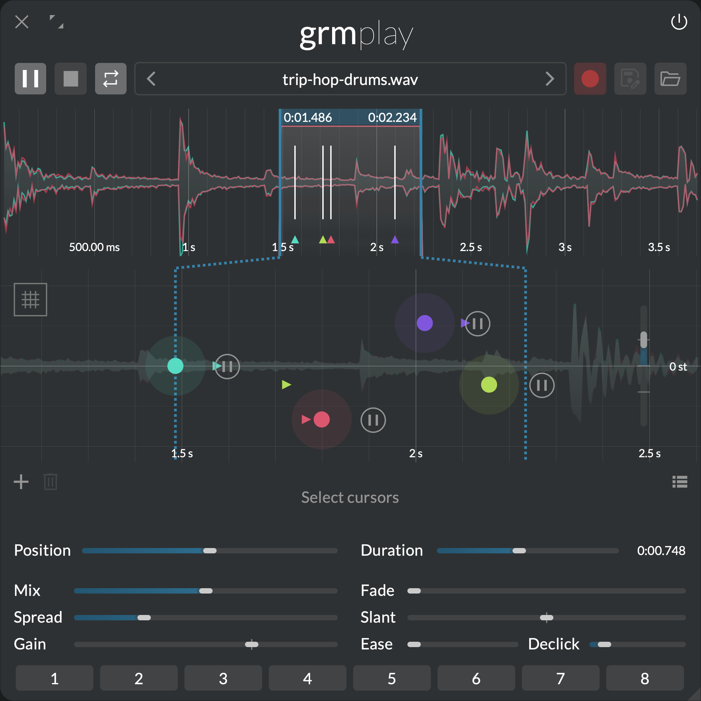
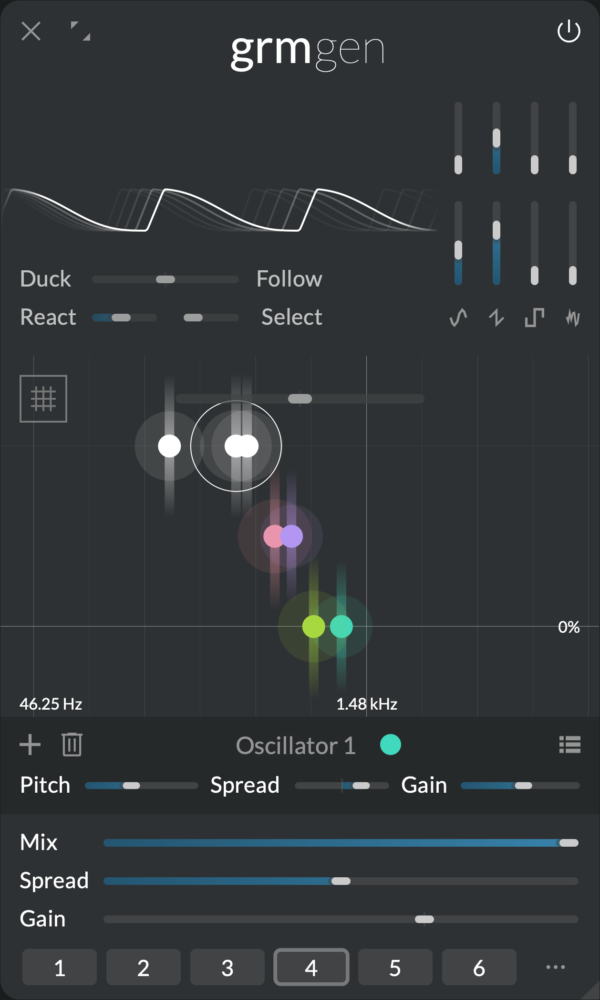
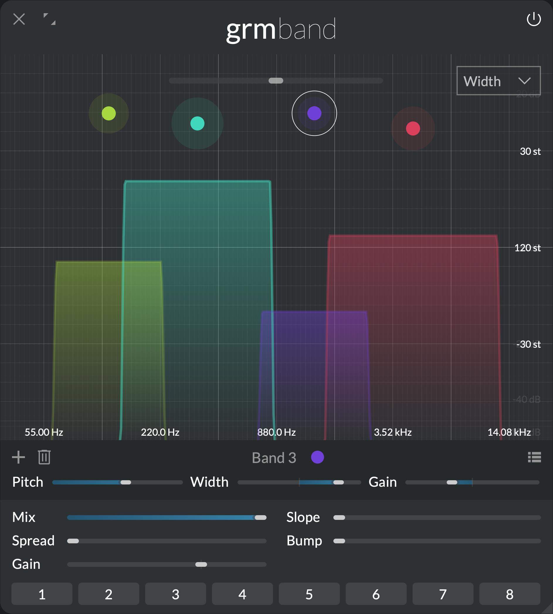
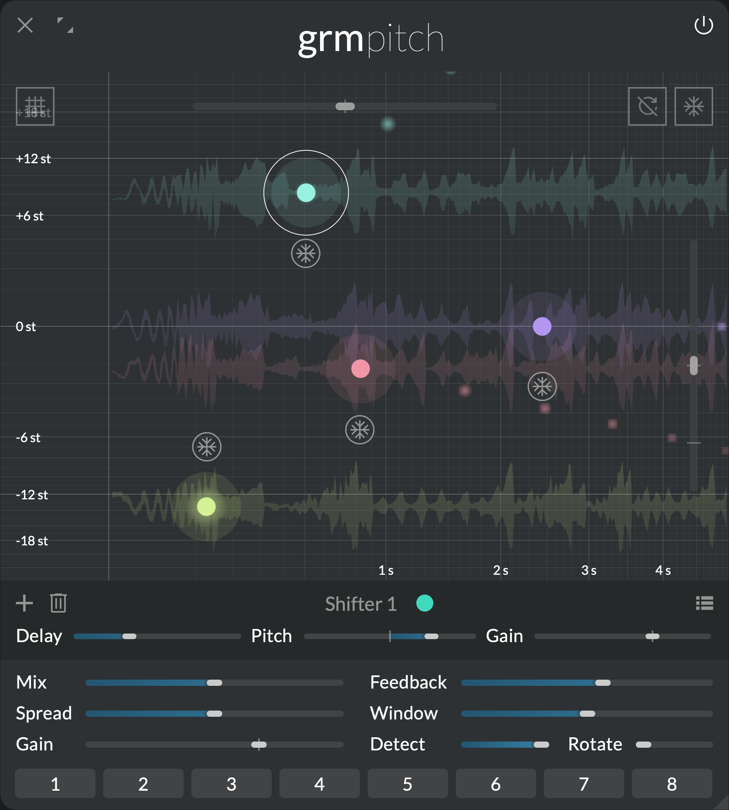
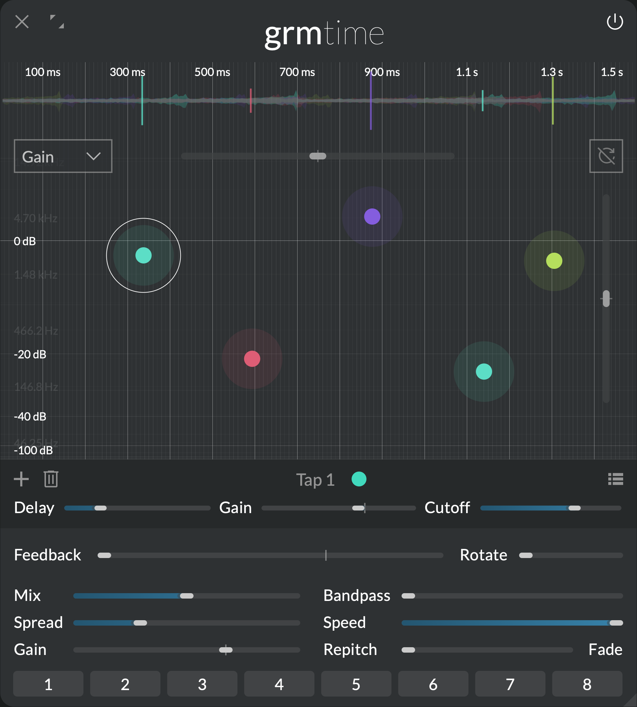
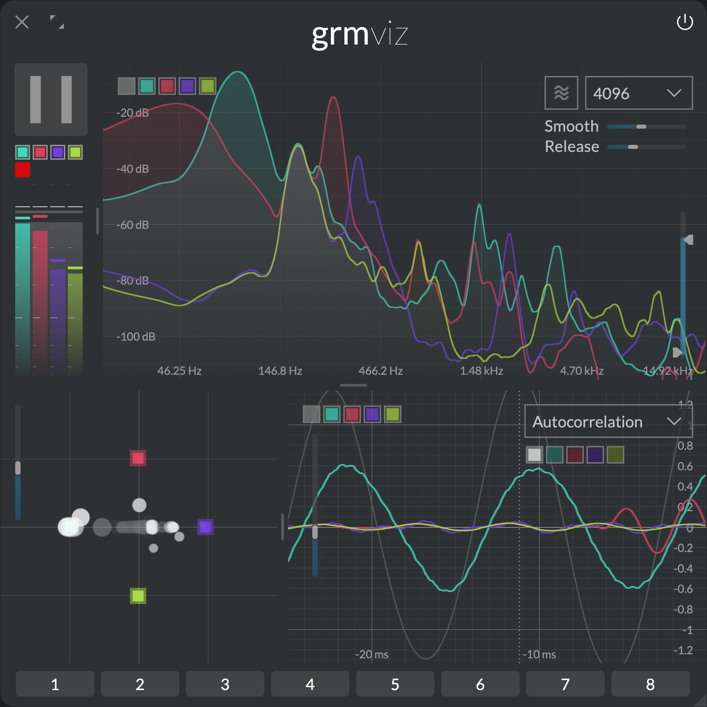
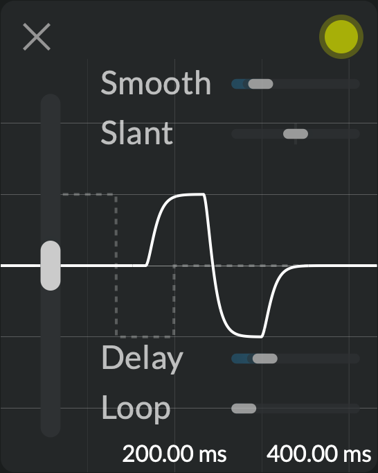
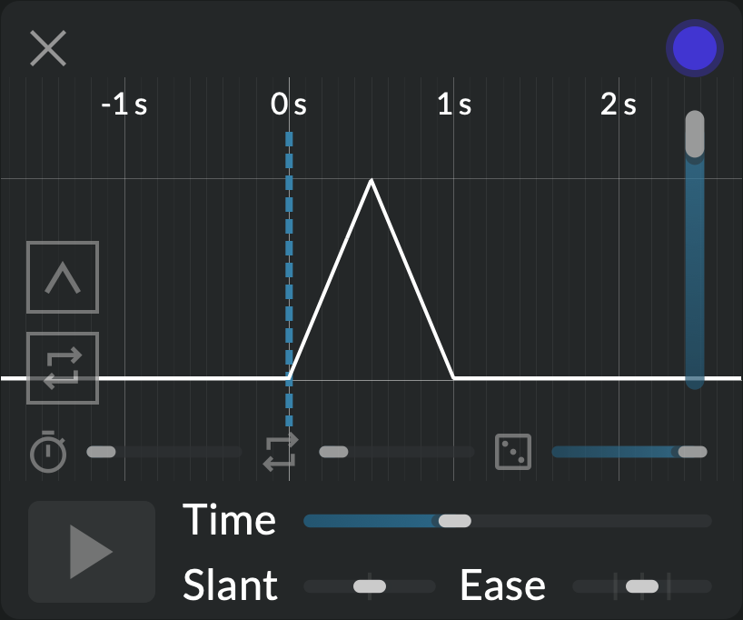

# Modules

## Processors

[{.carousel-img}](play.md)
[{.carousel-img}](gen.md)
[{.carousel-img}](comb.md)
[{.carousel-img}](band.md)
[{.carousel-img}](pitch.md)
[{.carousel-img}](time.md)
[{.carousel-img}](gain.md)
[{.carousel-img}](viz.md)

## Modulators

[{.carousel-img-small}](agitation.md)
[{.carousel-img-small}](control.md)
[{.carousel-img-small}](peak.md)
