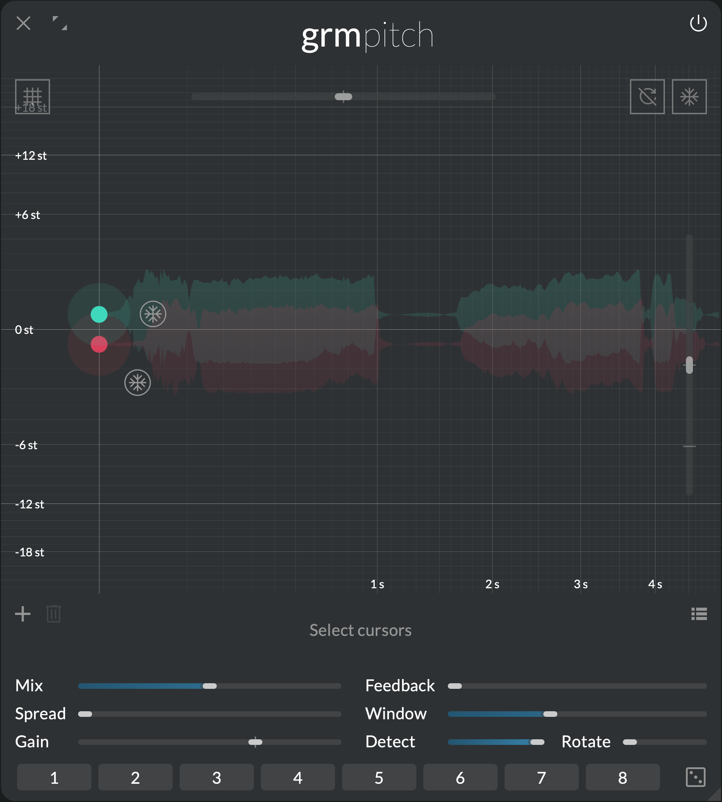
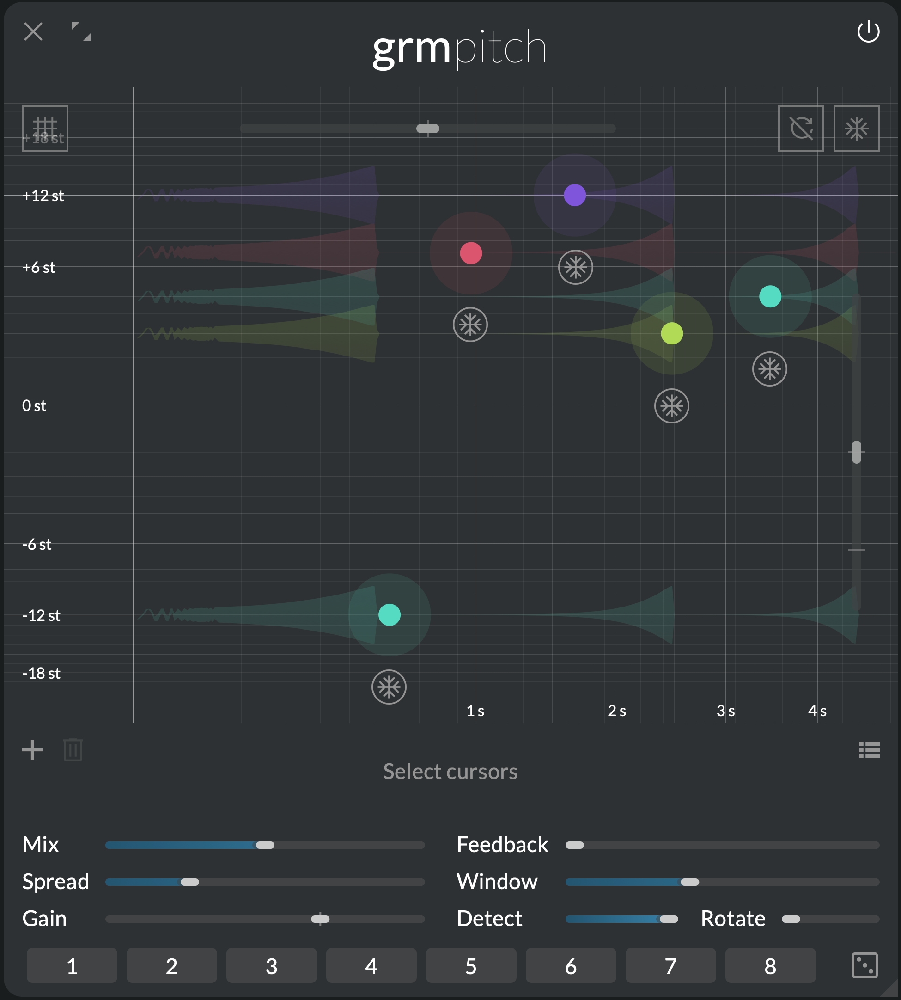

Not a pitch shifter
{.tagline}

# {.module-logo} Pitch

{.main-pic}

A pitch shifter changes the pitch of a sound without changing its duration. On the surface, this is what _Pitch_ is: a bank of pitch shifters combined with delays, placed on a convenient 2D surface. But rather than delivering just this, _Pitch_ deconstructs the concept and exposes it, piece by piece. Used for classic pitch tricks or to explore a wealth of novel ideas, _Pitch_ is more than just what its name suggests.

## Features

- Up to 8 pitch shifters/granular delays, placed on an intuitive 2D surface
- Wide transposition & delay range: from +48 semitones to -∞, up to 10 seconds delay
- Freeze function to scrub inside buffer
- Widely adjustable window size & correlation detection

## Context

Feed sound into _Pitch_, click to add a pitch shifter: the sound is delayed and transposed.

But what actually happens is not magic: the input is recorded into a buffer, and two overlapping playheads continuously read small grains of sound around the cursor (the delay time), at a speed proportional to the transposition required. Basic pitch shifting is just this: playing small overlapping grains of the input sound at speeds different than the recording speed!

Combined with correlation detection to adjust grain positions, this overlap/add technique is the archetype of pitch shifting algorithms ([_WSOLA_](https://ieeexplore.ieee.org/document/319366)), and with short grain size and strong correlation detection, it works especially well on monophonic sounds; otherwise artifacts start to be heard.

_Pitch_ can act as a convincing bank of pitch shifters, but really shines when breaking free from its traditional use, leveraging its very nature: with a wide range of grain sizes (from 4 ms to 2 seconds), adjustable correlation detection and freezing, you can explore playing with granular scrubbing, transient doubling or amplitude modulation artifacts in new, creative ways.

---

## Controls

### Cursor area

Click to add a pitch shifter; double-click a pitch shifter to remove it. Each pitch shifter runs in parallel with its own buffer; they are then mixed to the output.

The following parameters are local to each pitch shifter:

- **Delay (X axis):** Pitch shifter delay time.
- **Pitch (Y axis):** Pitch shifting amount. Sets the grains playback rate relative to normal rate.
- **Gain (Z axis):** Pitch shifter gain.
- **Freeze** button: Stops feeding audio into this pitch shifter buffer, and read current content in-place.

The following parameters have as many independently-modulatable instances as there are pitch shifters (see [Modulation](../atelier/modulation.md)):

- **Freeze** button: Inverts the Freeze state of all pitch shifters (see local **Freeze** parameter).
- **Delay ratio:** Scales all delays by the given ratio.
- **Rate:** Scales all pitches by the given ratio. Negative ratios mean reverse grain playback.

Finally two buttons at the top modify the state of _Pitch_:

- **Quantize**: click to quantize all pitches to the closest semitone.
- **Clear all buffers**: click to silence all delay buffers

### Global controls

- **Mix:** Crossfades between the dry (0%) and the wet signal (100%).

The following parameters have as many independently-modulatable instances as there are pitch shifters (see [Modulation](../atelier/modulation.md)):

- **Spread:** Channel-locality of each pitch shifter. At 0%, each pitch shifter processes only the channels it is assigned to (see the global [Spread](../atelier/multichannel.md#spread) section); at 100%, all pitch shifters process all channels in parallel (multi-mono).
- **Gain:** Global gain of all pitch shifters.
- **Feedback:** How much of each pitch shifter's output is reinjected into its input. Feedback is local to each pitch shifter. As feedback gets higher, repetitions are displayed as dots where they will appear in the cursor area.
- **Window:** Duration of the pitch-shifted grains.
- **Detect:** Precision of the correlation detection. At 100%, a correction is applied to each grain starting position to correlate better with the currently playing grain to avoid phase cancellations. At 0%, this correction is disabled, resulting in an amplitude modulation-type effect.
- **Rotate:** Rotates the channels in the feedback path. At 0%, each channel's feedback paths is completely independent; at 100%, each channel feeds back into its successor and the last one feeds back into the first, resulting in a generalized ping-pong delay-like effect.

---

## Tips and tricks

### Harmonize

{width=50%, align=right}

A staple of studio effects: with a voice or solo instrument as input, just add two 0-delay pitch shifters at pitches close to zero. The voice is doubled and thickened. reduce **Spread** to increase the width effect to taste. Add more pitch shifters at harmonic intervals to make chords.

### Granulator

Now move the **Delay** of individual pitch shifter manually (hold `⌥` to lock the Y axis). Since delay changes only happen when a new grain starts, the material gets scrubbed granularly without repitch. You can modulate **Delay** to automate this movement: small & fast random modulation will scatter grains like a typical granular effect; large & slow modulation will slow down or speed up the material. Play with **Window** and listen its effect on grain size while **Delay** is modulated.

### A sequencer for audio

{width=50%, align=left}

Disable modulations and use **Delay** to spread out the chord in time. If fed with a single isolated tonal event (a note), it will go through each pitch shifter successively, repeating it in a sequence. To quantize events in time, use time graduations, and then **Delay ratio** to match your desired tempo. Play with **Feedback** and adjust pitches and timings so that repetitions interact in interesting temporal and harmonic patterns.

### Walk the frozen buffer

At any time, enabling **Freeze** (locally on a pitch shifter or globally) will stop the buffer and play continuously from the pitch shifter's positions, allowing to scrub through the material freely. Note that all **Freeze** buttons are modulatable.

!!! note

    The content of _Pitch_'s buffer is not saved when a patch is saved. Next time you open it, you need to reload audio material into it.

### Switch off your targeting computer

Correlation detection (**Detect**) slightly adjusts the start position of each grain so that it aligns as much as possible with the previous one, minimizing phase cancellation "artifacts" at the junction between two grains. With large grains, this is heard as "beatings", i.e. changes in amplitude; with small grains, this is heard as a pitched amplitude modulation. Use the artifact creatively: set a small **Window**, disable **Detect** and play with **Pitch** to chase interesting formant-shifting effects.
