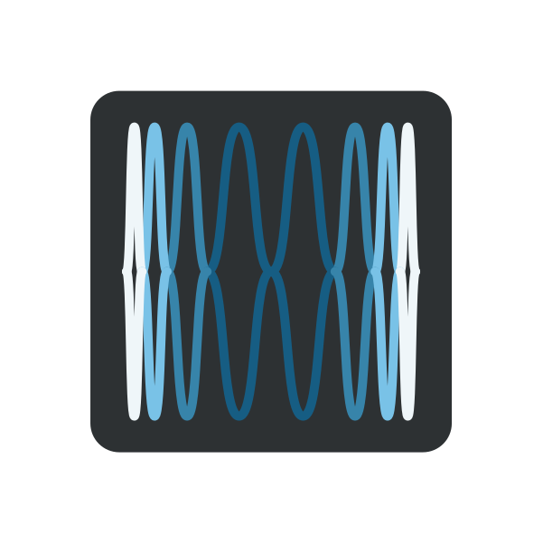

TODO
{.tagline}

# {.module-logo} Pitch

!!! warning "This section is a **work in progress**"

{.main-pic}

## Features

## Context

## Controls

### Cursor area

- **Quantize** button: click to quantize all filter frequencies to the closest semitone.
- **Clear all buffers** button: click to silence all delay buffers
- **Freeze** button: Inverts the frozen state of all active pitch shifters

- **Delay ratio:** Global delay ratio. Scales all delays by the given ratio.
- **Rate:** Global playback/shift rate. Scales all pitches by the given ratio. Negative rate means
  reverse playback.

Local:

- **Pitch:** Pitch shifting amount
- **Delay:** Delay time
- **Gain:** Individual pitch shifter gain
- **Freeze:** Freeze pitch shifter

### Global controls

- **Mix:** Crossfade between the dry and wet signal
- **Spread:** How much each pitch shifter will be applied to its assigned channel's signal (0%) or
  to all other channels (100%)
- **Gain:** Global gain
- **Feedback:** Feedback amount, local to each shifter
- **Window:** Size of the individual pitch-shifted grains
- **Detect:** Precision of the pitch detection
- **Rotate:** Rotates the channels in the feedback path. At 0%, each channel's feedback paths is
  completely independent; at 100%, each channel feeds back into its successor and the last one feeds
  back into the first, resulting in a generalized ping-pong delay-like effect.

## Tips and tricks

### Melodies

### Ring-modulation

### Walk the frozen buffer

### Granulator
