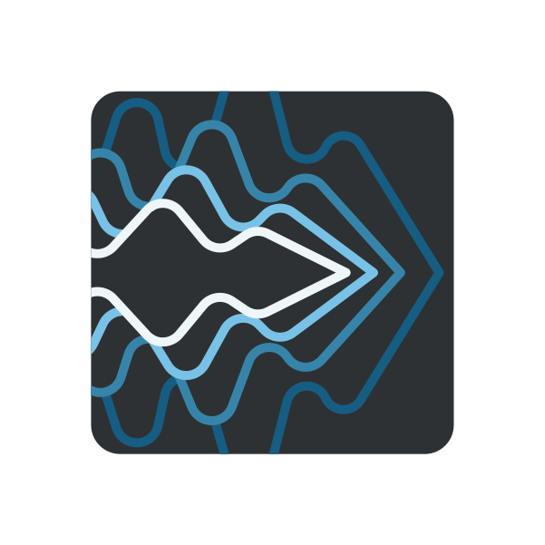
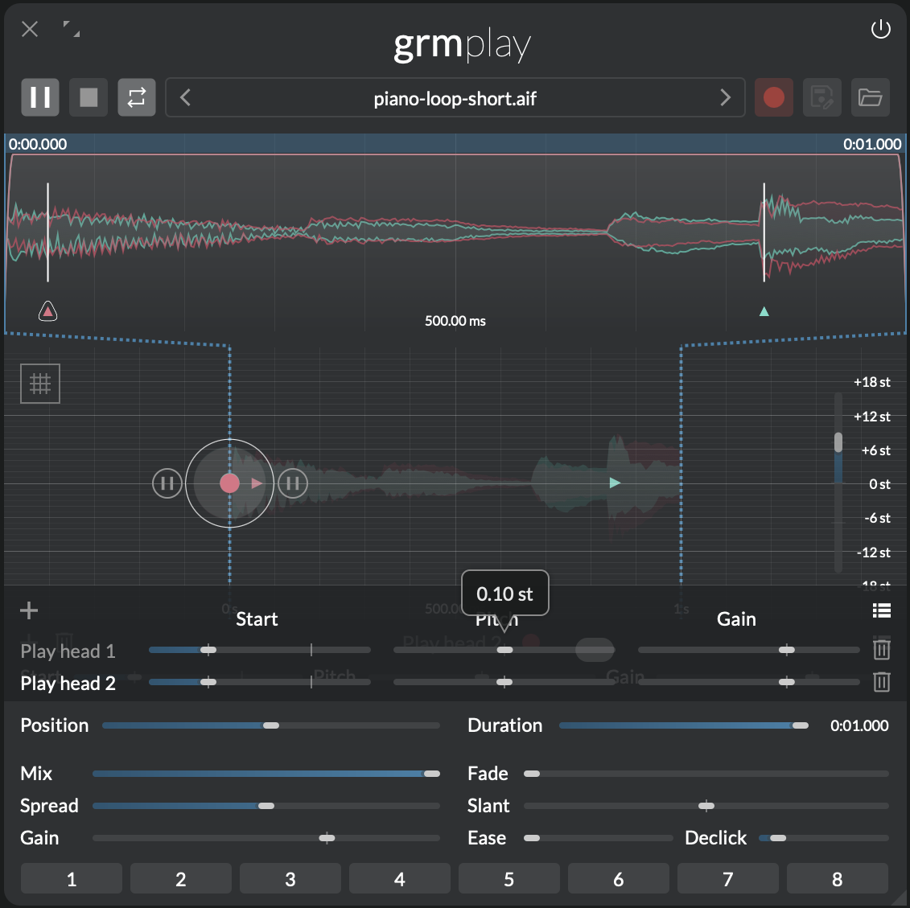
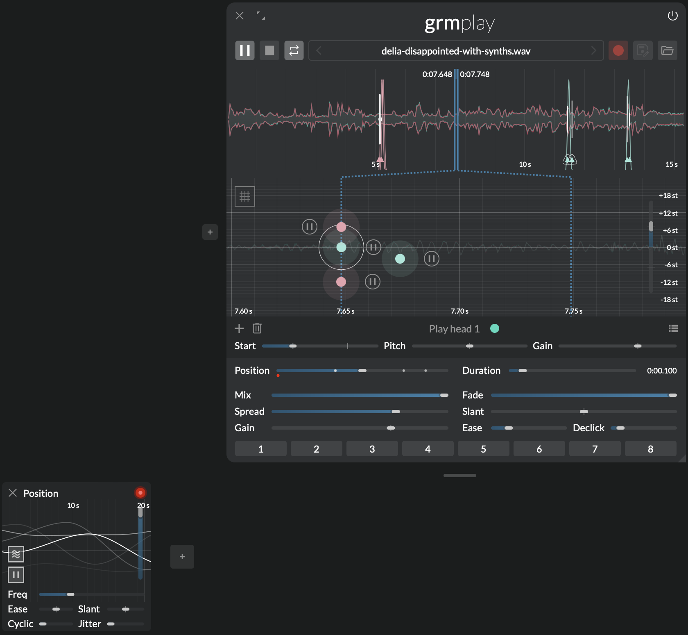
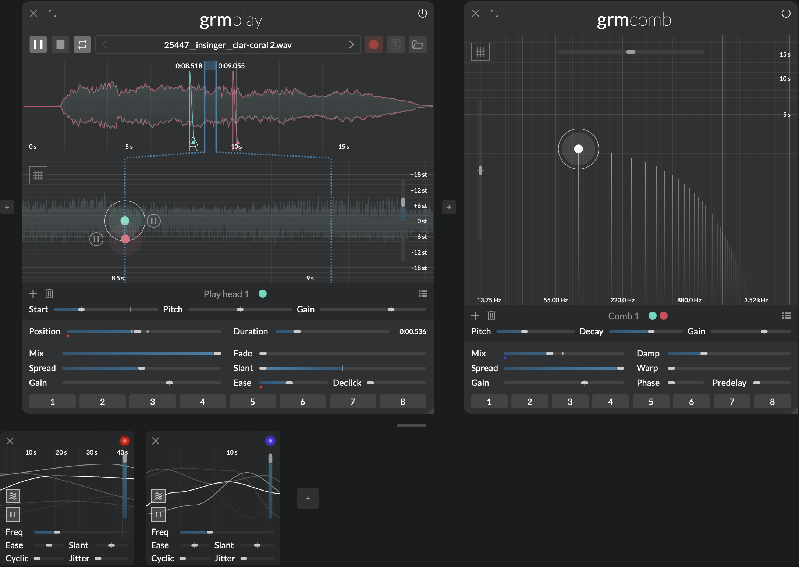
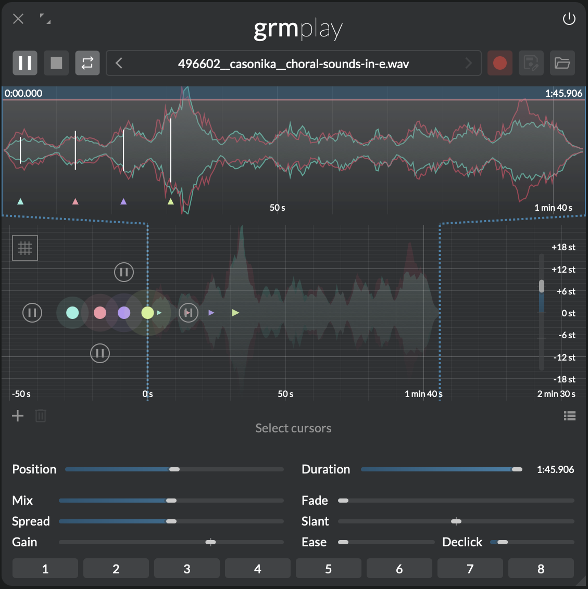

Audio file playground
{.tagline}

# {.module-logo} Play

{.main-pic}

_Play_ is a multi-playhead file player with versatile playback region and envelope controls. It allows mangling any source material into a wide variety of outcomes. From percussive glitches to mesmerizing drones. Its built-in recording functionality allows sampling of inputs or resampling of whole patches.

## Features

- Multiple playheads with adjustable pitch and position
- Built-in recording into a temporary buffer, saveable to file
- Looped and single shot playback
- Global and individual transport controls for each playhead
- Playback in forward and reverse direction

## Context

Spliced tape, varispeed and reversed reels: in the hands of musique concrète artists, the reel-to-reel recorder became an instrument, turning sound itself into material for playful experimentation. _Play_ taps into this history enabling polyphonic exploration of the source material without cluttering your desk with snippets of magnetic tape.

When playing sound from a tape speed and pitch are invariably linked. Doubling the playback speed pitches the recorded material up by an octave. Halving it pitches it down by an octave. Playing the same material in a loop with a difference of 7st (perfect fifth) creates a 3:2 pattern.

Each cursor can have an independent pitch and playback position. Fade is applied on play and pause as an envelope. In looped mode it additionally determines the overlap of the loop region. If fade is at 100% the sound will always overlap. When a region changes during playback the playhead will attempt to restart within the new region. To ensure a smooth and consistent playback it will keep fading out from its original position.

_Play_ can load mono, stereo and multichannel audio files. If the number of channels in the audio file don't match the number of channels of the module [fanning and folding](../atelier/multichannel.md#fanning-and-folding) will be employed to distribute the channels to your outputs.

---

## Controls

### Toolbar

- **Play/pause:** Global transport state. Toggles playback of all playheads, stopping or resuming playback from their last position. This parameter has as many independently-modulatable instances as there are playheads (see [Modulation](../atelier/modulation.md)).
- **Stop:** Immediately stops playback of all playheads, and reset to their start position.
- **Loop/single shot:** When toggled on, playback loops until paused. When toggled off, the region plays once until Play/Pause is toggled another time.
- **File browser:** Shows the currently loaded file. Click to bring up a list of audio files in the same directory. When hovered, shows file information in the info area.
- **Record:** Records the input of the module into a temporary buffer (max. 1 minute).
- **Save:** Save temporary buffer to file.
- **Open file:** Opens an audio file.

!!! tip

    **Play/pause**, **Loop** and especially **Record** are all modulatable!

### Region overview

The region overview shows a view of the entire file, the playback region and the envelope. Click-and-drag the waveform to zoom and pan. The blue translucent bar at the top shows the playback region. Vertically drag it to shrink/enlarge the region, horizontally drag to move. Additionally, start and end vertical bars can be adjusted by dragging. Holding down alt while dragging anywhere on the waveform allows to define a new playback region.

### Cursor area

Click to add a playhead; double-click a playhead to remove it.

- **Quantize button:** Click to quantize all playhead pitches to the closest semitone.
- **Rate:** Playback speed, relative to nominal file speed. Negative means reverse. This parameter has as many independently-modulatable instances as there are playheads (see [Modulation](../atelier/modulation.md)).

Each playhead has four controls:

- **Play/Pause button:** Playhead playback state. If global playback is enabled, this control is inverted.
- **Start (X axis):** Playhead position after it ended playing, or the Stop button was pressed. If the start position lays outside of the playback region (less than 0% or more than 100%) playback will start with a delay.
- **Pitch (Y axis):** Playhead playback speed, in semitones relative to nominal file speed.
- **Gain (Z axis):** Playhead output gain.

### Global controls

- **Mix:** Crossfades between the input signal (0%) and the playheads signal (100%).

The following parameters have as many independently-modulatable instances as there are playheads (see [Modulation](../atelier/modulation.md)).

- **Position:** Center position of the playback region.
- **Duration:** Duration of the playback region, as a percentage of the total file length. The actual duration in seconds is indicated next to this slider.
- **Spread:** Channel-locality of each playhead. At 0%, each playhead reads only the channels it is assigned to (see the global [Spread](../atelier/multichannel.md#spread) section); at 100%, each playhead reads all channels of the file.
- **Gain:** Output gain of all playheads. Added to the gain of playhead.
- **Fade:** Combined length of the fade-in and fade-out envelope. In loop mode, it determines the cross fade time.
- **Slant:** Ratio of time spent fading in vs. fading out. At 0% the attack is instant and the entire time is used for the fade out; at 50% the envelope is symmetric; at 100% the envelope is slanted towards the right.
- **Ease:** Easing curve of the applied fades, from linear (0%), to abrupt (100%).
- **Declick:** Minimum time of any fades. A value of 0 allows clicks; anything above quickly fades any transition: start, stop, (cross-)fade.

---

## Tips and tricks

!!! note

    Dragging an audio file from _Ateiler_'s own patch recorder or the system’s file explorer anywhere into the processor chain creates an instance of _Play_ with the file in place.

### Phasing

{width=50%, align=left}

To achieve a phasing effect — as popularized by Steve Reich — place two playheads at the same exact spot. Changing the **Start** of one playhead introduces a fixed time gap between both heads; slightly changing **Pitch** instead gradually desynchronizes both playheads. Hold `⇧` while dragging for fine control. This effect is easiest explored with short rhythmical loops.

### Granular playback

Try repeating tiny segments — or grains — of audio (typically 1 to 100 milliseconds), and modulating the region. Set the **Duration** to a very small value. Add a generous amount of **Fade** to smooth out the grains. Add several playheads with different pitches to create a chord. Reset the position to 50%. Now add a modulation to **Position**, [Peak](peak.md) to create a constant ascending slope, or [Agitation](agitation.md) for unexpected scrubbing. Adjust its time to vary the granular scrubbing speed.

### Percussions with drone material using fades

Using envelope shapes it is easy to reappropriate drone-y material for percussive sounds. Create one or more playheads, adjust the duration and bring **Slant** to 0%. Adjust **Ease** to make a fast decay. If you want sharp, clicky attacks set **Declick** to 0ms. Optionally modulate **Position** to get more variety. Tip: this might pair nicely with [Comb](comb.md) further down the chain.

### Multichannel cannon

{width=50%, align=right}

When a playhead's **Start (X axis)** parameter is less than 0% it will start out muted until it reaches the playback region. This effect can be exploited to create cannons. Place several playheads in a row, spacing **Start** at regular intervals before 0%. Make sure all **Pitch** are equal. Now, when you press **Play**, one playhead after the other will reach the the playback region with the predefined delay. Once they reached the end of the region they will loop and start from the beginning, creating a cannon.

If you want to play the cannon in reverse, move all the playheads so their **Start** is after the 100% marker, and set **Rate** to -1x.
