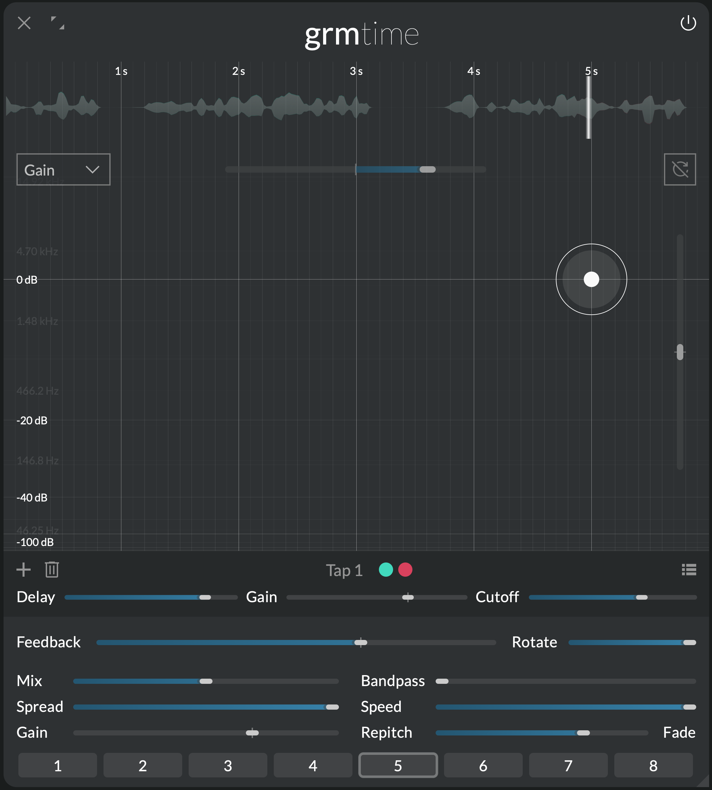
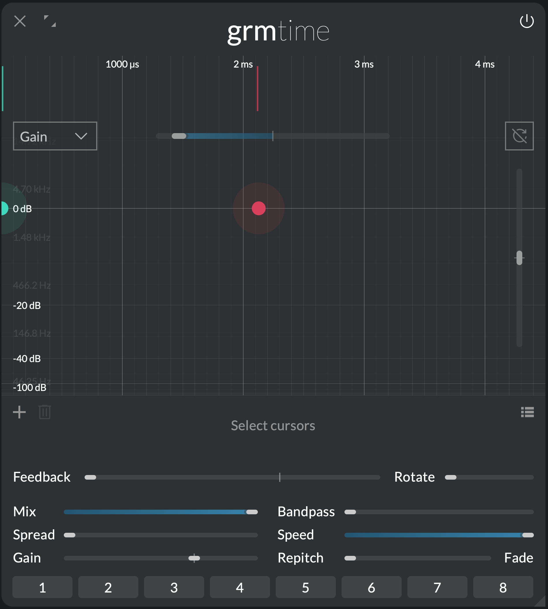

# Time

_Temporal machine_

{.main-pic}

!!! warning "This section is a **work in progress**"

Take some audio as input, and output it as-is... just a while later: a _delay_ seems to be
barely a musical device. This is precisely what makes it an indispensable tool: like a stick or a
rope, it can be a thousand things!

<!-- purely time-domain operations -->
<!-- unlike a traditional delay -->
<!-- 10 milliseconds or 10 minutes -->

At its heart, _Time_ is a multi-tap delay with granular playback and per-tap built-in resonant
filter, taking inspiration from GRM's Phonogene and Morphophone family of instruments.

## Features

- freely-tunable delay with multiple tap (up to 32 taps)
- per-tap resonant band-pass filter
- variable-rate write/read speed
- continuous control of repitching vs. granular (crossfading) playback

## Context

<!-- magnetic tape or digital samples: work the same -->
<!-- The advent of magnetic tape -->

## Controls

### Cursor area

Click to add a tap; double-click a tap to remove it. Each tap reads from the same audio buffer at
different delay times; it is then band-pass-filtered indepently and summed to the output and to the
feedback path.

- **Clear audio buffer:** instantly clears all audio material in the buffer.
- **Y axis parameter:** The combo box determines which parameter is displayed on the Y axis (and
  consequently which is displayed on the Z axis, ie. cursors' halo size): either **Gain** or
  **Cutoff**.

The following parameters are local to each tap:

- **Delay (X axis):** Delay time of the tap.
- **Gain (Y or Z axis):** Gain of the tap.
- **Cutoff (Z or Y axis):** Band-pass filter cutoff frequency of the tap.

The following parameters have as many independently-modulatable instances as there are taps (see
  [Modulation](../atelier/modulation.md)):

- **Delay scale:** Scales all delay times by the given ratio.
- **Transposition:** Transposes the cutoff frequencies of all taps.

### Global controls

- **Mix:** Crossfades between the dry signal (0%) and the wet signal (100%).
- **Speed:** Transport speed, or how fast the digital "tape" is moving. Affects the speed at which
  the input audio is written to the buffer, as well as the read speed. At speeds < 1x, there are
  less samples to record the incoming audio, so the fidelity is (interestingly) degraded.
- **Rotate:** Rotates the channels in the feedback path (see **Feedback**). At 0%, each channel
  feeds back into itself; at 100%, each channel feeds back into the next one, and the last one feeds
  back into the first, resulting in a generalized ping-pong delay-like effect.

The following parameters have as many independently-modulatable instances as there are taps (see
  [Modulation](../atelier/modulation.md)):

- **Spread:** Channel-locality of each tap. At 0%, each tap outputs only on the channels it is
  assigned to (see the global [Spread](../atelier/multichannel.md#spread) section); at 100%, each
  tap plays all channels in parallel (multi-mono).
- **Gain:** Global gain of all taps
- **Feedback:** Amount of the sum of all taps that is fed back into the input. Careful: with several
  taps, may bloom and provoke loud sounds (even under 100%). To make blooming less aggressive, the
  feedback path includes a soft-clipping stage.
- **Bandpass:** How much band-pass filtering is applied to each tap. The bigger this value, the more
  resonance (or Q-factor) the band-pass filter has. 0 means no filtering at all.
- **Repitch/Fade:** Duration of the tap's playback grains. When >0, a change in delay time will
  result in a crossfade, hence no repitch; at 0, grains are so small that playback is continuous,
  which repitches the input when delay time is changed. Grains are always played at speed 1, so
  lowering **Speed** while this is >0 will result in constant repitching.

## Tips and tricks

### Rhythmic taps

Feed _Time_ some simple rhythmic loop. Introduce a few taps, and arrange them in time so that they
repeat incoming audio in a rhythm of your choosing. Vary their gain and/or cutoff to taste. Tuning
is a long but rewarding process, as you discover new syncopations and grooves.

### Complex looping

With a single tap set to a long delay (several seconds), _Time_ can be used as a simple looper: just
crank Feedback to 100% and the material in the buffer will accumulate and repeat indefinitely (this
is Preset 5). Start here: feed some live-played input (voice, guitar, synth) and build layers upon
layers, interacting with past material as if it was another player.

From here, try out a few trics: modulate the delay time slightly for imperfect repetitions, lower **Speed** and/or increase **Bandpass** for generational degradation, add a second tap closeby for complex stereo interplays... the world of delays is your oyster.

### Flangers, choruses and all that

Flanger, chorus, ensemble, vibrato... all these classic effects are just variants of the same
concept that can easily be recreated with _Time_: short delays (1 to 50 ms) modulated by LFOs.
Mixing the dry and delayed signals carves out pleasing peaks and troughs into the frequency content
of your audio.

An _Agitation_ with 100% **Cyclic** will do the LFO. Add one or several taps around 10 ms, and
modulate their delay times (use **Delay scale**). Increase **Rotate** for stereo width. Increase
**Feedback** to taste. This is your bread-and-butter modulation effect; now explore this space for
effects unheard of: different LFO shapes, audio-rate modulation, degrading with **Speed** and
**Bandpass**, fade instead of repitch...

### Precedence effect

One important cue to the localization of sound is its relative time of arrival: if one ear receives
a sound before the other, the source will appear closer to it. A delay of a couple milliseconds is
enough to trick our brain. It is sometimes called the Haas effect.

Replicate this in _Time_: in stereo and listening on headphones, add two
taps: one at 0 ms, one around 2 ms. Set **Spread** to 0% and **Mix** to 100%. Your input will sound
like it leans to the left, even though the gain of each channel is the same. Vary the right-ear delay time and observe the effect.

Using this creatively is a well of interesting ideas: the same principle with 4 or 8 channels (introducing the same number of taps) creates impossible spatial effects; modulating delay times instantly densifies simple material.

### Reverb tails

As soon as more than one tap is introduced, **Feedback** will not sound like your standard
repetitions. This is because what is fed back is the _sum_ of all individual taps. For instance,
with two taps at 1 and 0.1 seconds respectively and feedback high enough, you will get repetitions
at seconds 0.1, 1, 1.1, 2, 2.1, 2.2, 3, 3.1, 3.2, 3.3 etc.: as the repetitions tail off, they become
"denser" (closer to each other). This can be used at your advantage: with >4 taps and carefully
choosing their times, we can come up with delay tails that quickly densify like reverbs, resulting
in a variety of hybrid reverb/delay effects. This is especially true when delay times are slowly and
slightly modulated, to cut off any resonance buildups.
