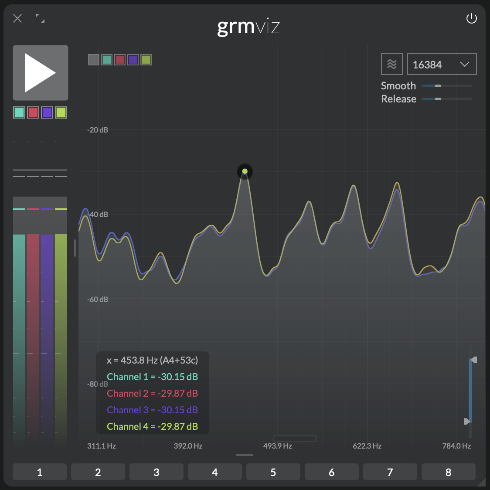

Insight at a glance
{.tagline}

# {.module-logo} Viz

{.main-pic}

_Viz_ is a versatile tool to probe and visualize multichannel signals anywhere in the audio chain. It features VU-meters, a spectrum analyzer/spectrogram, a correlation meter and an oscilloscope, all adapting your available channel configuration. From a bird's eye view on the evolution of rhythmic patterns down to sample accurate measurements, _Viz_ is a visual insight into sound.

## Features

- Multichannel oscilloscope, spectrum analyzer, spectrogram and correlation meter
- Zoomable and pannable views everywhere
- Large, freely-explorable oscilloscope buffer

## Context

_Viz_ was originally conceived as an internal tool for development and debugging but quickly turned out to be a valuable tool for signal processing education and patch troubleshooting. So here it is!

<!-- TODO rework this part: -->

The **oscilloscope** is maybe one of the oldest electronic sound visualization tools and a staple in every classic electronic music studio. The beam of a cathode ray tube is deflected vertically with the amplitude of the sound while it repeatedly scans from left to right on the horizontal axis. Thus an image of a the waveform is temporarily projected onto the screen. On digital systems the image is produced by buffering a small portion of the input and drawing connections between the samples. _Viz_' oscilloscope has a buffer that holds the last ten seconds of input. The view can be freely zoomed allowing for a graphical display of the entire buffer down to individual samples.

The **spectrum analyzer** analyzes very short fragments of audio computing the amplitudes of frequencies that make up the analyzed signal. In the digital world this is done using the _Fast Fourier Transform (FFT)_ where the spectrum is split into a discrete set of frequency bins that are analyzed. An FFT of bigger size is more accurate because it analyzes a longer segment of the signal, which allows it to distinguish between frequencies that are very close together. The more data points it uses, the finer the frequency resolution, so you can see smaller differences between pitches in the spectrum. However the bigger the size of an FFT the slower it reacts. So choosing the size of an FFT is a tradeoff between frequency accuracy and precision in the time domain.

<!-- TODO explain how correlation meter works -->

The **correlation meter** visualizes the similarity between multiple audio channels over time. It is especially useful for analyzing phase relationships. _Viz_ brings this to a whole new dimension correlating not only stereo channels with each other but highlighting the relationship between all channels.

---

## Controls

_Viz_ is split into four zones that can be freely resized.

### Controls and meters

- **Pause:** When toggled on freezes inputs. Views can be explored (zoomed etc.) during pause.
- **Channel mute:** Clicking toggles channel muting;  `⌘`-click solos a channel. Click and toggles several channels at once.
- **VU-Meters:** Show the RMS loudness of each channel in the channel's color, and its peak value as a bar. Underlaid in white is the sum of all channels. Hover over a VU-Meter to see a numerical readout in the info area.

### Spectrum analyzer and spectrogram

Displays the spectrum or the spectrogram. Hover over the display to get a readout of the current value. Drag vertically to zoom in, horizontally to pan into the view. Double-click to reset. 

<!-- TODO: document channel selectors + sum channel -->

- **Spectrogram button:** Toggles between spectrum and spectrogram display.
- **FFT size:** FFT size of the spectrum analyzer (tradeoff between time and frequency precision).
- **Smooth:** Frequency smoothing amount. The more smoothing applied, the less frequency-domain details are visible.
- **Release:** Each frequency's release time.
- **Spectrum amplitude range:** Adjusts the dynamic range of spectrum analyzer.

### Correlation meter

Each square represents a channel; squares can be dragged and re-arranged for better readability.

- **Correlation meter zoom:** Display zoom.

### Oscilloscope

Displays the raw waveform of input signal, with a history of 20 sec. Hover over the display to get a readout of the current value. Drag vertically drag to zoom; drag horizontally to pan into the view. Double-click to reset.

<!-- TODO: document channel selectors + sum channel -->
<!-- TODO: explain better each trigger source + risign edge threshold -->

- **Trigger source:** Trigger source of oscilloscope. Options are:
    - Autocorrelation
    <!-- TODO with bar + pitch -->
    - Frequency
    - Rising Edge
- **Trigger frequency:** Controls the retrigger frequency when **Trigger source** is set to "Frequency"

---

## Tips and tricks

### Identify pitches

{width=50%, align=right}

You can use the spectrum analyzer with its numerical readout to determine the pitch of an input signal. First set the **FFT size** to 16384. Press **Pause** to freeze the audio input. Then identify the highest peak in the spectrum. Click + drag the mouse to zoom in on the peak. When you move the mouse over the display you'll see a colored dot marking its current position on the x-axis and the amplitude on the y-axis. On the "head-up display" you'll see the exact frequency and musical pitch corresponding to the mouse position.
