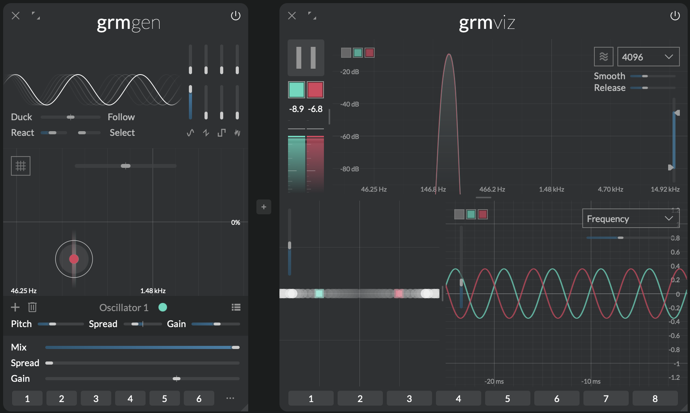

Insight at a glance
{.tagline}

# {.module-logo} Viz

!!! warning "This section is a **work in progress**"

{.main-pic}

While not an audio processor in its narrow sense _Viz_ is a versatile tool to probe and visualize signals anywhere in the audio chain. It features an oscilloscope, a spectrum analyzer, a spectrogram and a multichannel correlation meter.

Its smooth high resolution spectral display helps to easily identify pitches of input signals. The oscilloscope with its unusually large display buffer allows seamless zooming and exploration in the time domain. From a bird's eye view on the evolution of rhythmic patterns down to sample accurate measurements of signals.

Both displays layer visualizations for each discrete channel. Optionally they can also sum all channels into a single graph.

## Features

- Multichannel oscilloscope, spectrum analyzer, spectrogram and correlation meter
- Zoomable and pannable views
- Smooth and adjustable display of spectrum and oscilloscope
- Large display buffer

## Context

_Viz_ was originally conceived as an internal tool for development and debugging but quickly turned out to be a valuable tool in the toolbox of musicians.

The **oscilloscope** is maybe one of the oldest electronic sound visualization tools and a staple in every classic electronic music studio. The beam of a cathode ray tube is deflected vertically with the amplitude of the sound while it repeatedly scans from left to right on the horizontal axis. Thus an image of a the waveform is temporarily projected onto the screen. On digital systems the image is produced by buffering a small portion of the input and drawing connections between the samples. _Viz_' oscilloscope has a buffer that holds the last ten seconds of input. The view can be freely zoomed allowing for a graphical display of the entire buffer down to individual samples.

The **spectrum analyzer** analyzes very short fragments of audio computing the amplitudes of frequencies that make up the analyzed signal. In the digital world this is done using the _Fast Fourier Transform (FFT)_ where the spectrum is split into a discrete set of frequency bins that are analyzed. An FFT of bigger size is more accurate because it analyzes a longer segment of the signal, which allows it to distinguish between frequencies that are very close together. The more data points it uses, the finer the frequency resolution, so you can see smaller differences between pitches in the spectrum. However the bigger the size of an FFT the slower it reacts. So choosing the size of an FFT is a trade of between frequency accuracy and precision in the time domain.

!!! note
    Due to the non-linearity in pitch perception but the linear nature of frequency bin distribution in FFTs generally a larger window has to be chosen to analyze low-frequency content.

The **correlation meter** visualizes the similarity between multiple audio channels over time. It is especially useful for analyzing phase relationships. _Viz_ brings this to a whole new dimension correlating not only stereo channels with each other but highlighting the relationship between all channels. 

---

## Controls

_Viz_ is split into four zones that can be freely resized. 

### Controls and meters

- **Pause:** When toggled on freezes inputs. Views can be explored (zoomed etc.) during pause.
- **Channel Mute:** Clicking toggles channel. Cmd + click solos a channel. Use click + drag to toggle several channels at once.
- **VU-Meters:** Show the loudness of a channel in the channel's color. Underlayed in white is the sum of all channels. Hover the mouse over a channel VU-Meter to see a numerical readout in the help area at the bottom of _Atelier_'s window.

### Spectrum analyzer and spectrogram

- **Display:** Displays the spectrum or the spectrogram. Vertical drag to zoom in frequency domain. Horizontal to choose the frequency range. Double-click to reset.
- **Spectrogram button:** Toggles between spectrum and spectrogram display.
- **FFT size:** FFT size of the spectrum analyzer (a tradeoff between time and frequency precision).
- **Smooth:** Spectrum frequency smoothing amount. At 0% accurate but jagged; at 100% very smooth.
- **Release:** Spectrum display release time.
- **Spectrum amplitude range:** Adjusts the dynamic range of spectrum analyzer.

### Correlation meter

Channels can be dragged and re-arranged to better match the physical space loudspeakers are arranged in.

- **Correlation meter zoom:** Display zoom.

### Oscilloscope

- **Oscilloscope display:** Displays the waveform of the current input. Vertical drag to zoom in time domain. Horizontal drag to choose the time range. Double-click to reset.
- **Trigger source:** Trigger source of oscilloscope. Options are:
    - Autocorrelation
    - Frequency
    - Rising Edge
- **Trigger frequency:** Controls the retrigger frequency when **Trigger source** is set to "Frequency"

---

## Tips and tricks

### Identify pitches

You can use the spectrum analyzer with its numerical readout to determine the pitch of an input signal. First set the **FFT size** to 16384. Press **Pause** to freeze the audio input. Then identify the highest peak in the spectrum. Click + drag the mouse to zoom in on the peak. When you move the mouse over the display you'll see a colored dot marking its current position on the x-axis and the amplitude on the y-axis. On the "head-up display" you'll see the exact frequency and musical pitch corresponding to the mouse position.

### Observe phase effects on beat frequencies

When two sounds sound at almost but not exactly the same frequency they will interfere in such a way that they will cause a beating pattern similar to a tremolo. Using the correlation meter it is easy to observe why this is the case. First create a [Gen](gen.md) module. Set **Mix** to 100% and **Spread** to 0%. Create two sine oscillators and space them so that they have somewhere between 0.1 and 2 Hz of difference in frequency. Now insert a _Viz_ module in the chain after _Gen_. Observing the correlation meter you'll see how the white dots representing the audio signal will rhythmically oscillate between the edge of the frame and the center. When the dots are at the edge the signals are out of phase and cancel each other out. When the dot is in the center the signals reinforce each other. You can 'pin down' one of the signals on the oscilloscope by setting the **Trigger frequency** to the exact frequency of the oscillator. You'll see how the other signal appears to slowly move by sometimes aligning in phase and sometimes going out of phase. The beat frequency in Hz is simply the difference between both frequencies. So for example if you would want to create a beat frequency at 1/4 of 120 BPM just set the two oscillators to be exactly 2 Hz apart.
