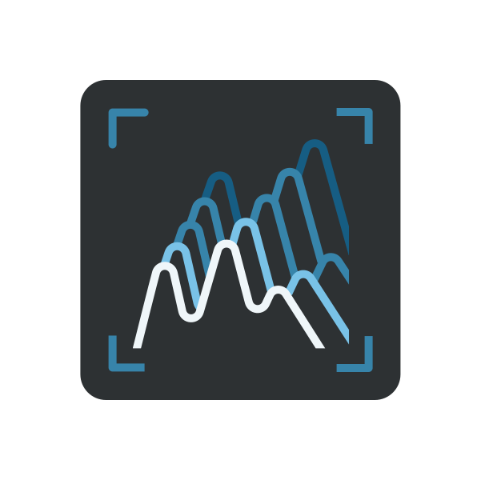

Sound insight
{.tagline}

# {.module-logo} Viz

{.main-pic}

_Viz_ is a complete toolset to probe and visualize multichannel signals anywhere in the audio chain. It features VU-meters, a spectrum analyzer/spectrogram, a correlation meter and an oscilloscope, all adapting to your channel configuration. From a bird's eye view down to sample accurate measurements, _Viz_ is a visual insight into sound.

## Features

- Fully multichannel signal analyzer, with zoomable and pausable views
- Full-featured oscilloscope with large, freely-explorable buffer
- Precise spectrum analyzer and spectrogram
- Unique multichannel correlation meter

## Introduction

_Viz_ was originally conceived as an internal tool for development and debugging, but quickly turned out to be a valuable asset for audio signal processing education, patch troubleshooting... or simply for the good looks. So here it is!

It consists of four analysis tools: a [VU-meter](#controls-and-vu-meters), a [spectrum analyzer](#spectrum-analyzer), a [correlation meter](#correlation-meter), and an [oscilloscope](#oscilloscope). The window is split accordingly into four zones that can be freely resized.

## Controls and VU-meters

{width=10%, align=right}

- **Pause:** Pauses input when toggled on, freezing all displays. Views can be explored (zoomed etc.) during pause.
- **Channel mute:** Clicking toggles channel muting;  `⌘`-click solos a channel. Dragging toggles several channels at once.

The VU-Meters show, in each channel's color:

- the RMS loudness as a gradient in the channel's color,
- its peak value as a solid bar,
- a clipping indicator (peak values above 0 dBFS) as a red square
  
Underlaid in white is the sum of all channels. Hover over a VU-Meter to see a numerical readout in the info area. Click to reset clipping indicator.

## Spectrum analyzer

The **spectrum analyzer** displays the frequency contents of the incoming audio in two different views: the [spectrum](https://en.wikipedia.org/wiki/Spectral_density) display and the [spectrogram](https://en.wikipedia.org/wiki/Spectrogram). Each channel is toggleable and overlaid with its own color. Both views are zoomable. Raw FFT signals can be hard to parse, therefore two adjustable smoothings are applied before display: frequency axis smoothing to get a broader view of the spectrum (**Smooth**), and time axis decay smoothing to better identify peaks  (**Release**).

Hover over the display to get a readout of the current value. Drag vertically to zoom in, horizontally to pan into the view. Double-click to reset.

- **Channel selectors:** Clicking toggles channel visibility. White toggles display of the sum of all channels.
- **Spectrogram button:** Toggles between spectrum and spectrogram display.
- **FFT size:** FFT size of the spectrum analyzer (tradeoff between time and frequency precision).
- **Smooth:** Frequency smoothing amount. The more smoothing applied, the less frequency-domain details are visible.
- **Release:** Each frequency's release time.
- **Spectrum amplitude range:** Adjusts the displayed dynamic range.

## Correlation meter

{width=30%, align=right}

The **correlation meter** is a quick way to visualize the relationship between channels, see where
energy is located and identify potential phase opposition problems. It is a multichannel
generalization of the classic stereo [goniometer](https://en.wikipedia.org/wiki/Goniometer_(audio)).
Each channel is identified by a colored square. It continuously computes the correlation between
each pair of channels, and displays a white dot for each channel. The size of the dot is the signal's amplitude. Its position depends on the correlation of its channel with all other channels: by default it sits on its channel; the more this channel is in phase with the other, the more it is attracted to it; the more out of phase it is, the more it is repelled by it. Therefore:

- Completely uncorrelated signals will be displayed as dots sitting mostly around their respective channels.
- Identical signals on all channels will be displayed as dots all sitting in the middle.
- If a pair of channels has signals out-of-phase, their dots will sit outside the line segment they form.

- **Correlation meter zoom:** Display zoom.

## Oscilloscope

{width=50%, align=right}

The **oscilloscope** provides a sample-accurate view of the input signal in the time domain. Each channel is displayed in its color, and can be toggled on or off. An additional white channel represents the sum of all channels. It has a large, 10-seconds audio buffer, easily explorable by zooming in and out, from seconds-long to individual samples display. Just like its hardware counterpart in electronics labs, the scope only draws the current waveform on screen when triggered by a certain event: repeatedly (_Frequency_), when the signal crosses the 0-boundary (_Rising edge_) or by estimating its most probably period (Autocorrelation). The rightmost edge of the display is when the event happened.

Hover over the display to get a readout of the current values. Drag vertically to zoom; drag horizontally to pan into the view. Double-click to reset zoom.

- **Vertical range:** Zooms vertically into signal amplitude
- **Channel selector:** Toggles channel visibility. The white button toggles the display of the sum of all channels.
- **Trigger source:** Selects which event triggers a refresh of the scope's display:
    - _Frequency_: the scope is refreshed at regular intervals, according to **Trigger frequency**.
    - _Rising Edge_: the scope is refreshed whenever the **Trigger channel** goes from below to above the **Rising edge threshold**, which is by default zero.
    - _Autocorrelation_: the signal's most probable period is computed, and the scope is triggered regularly at this period. This is the easiest way to get a steady reading of periodic waveforms.

!!! note

    When _Autocorrelation_ is selected, additional info is overlaid on top of the waveform view:

    - the autocorrelation waveform is displayed as a grey line
    - a vertical dotted bar indicates the most probable period
    - the hover display shows the signal's determined frequency and period

- **Trigger channel:** When **Trigger source** is _Rising Edge_ or _Autocorrelation_, sets the channel used for triggering.
- **Trigger frequency:** Controls how often the display is refreshed when **Trigger source** is set to _Frequency_
- **Rising edge threshold:** When **Trigger source** is _Rising Edge_, a draggable horizontal dotted line appears on the display. It sets the threshold the signal must pass to trigger a refresh.
